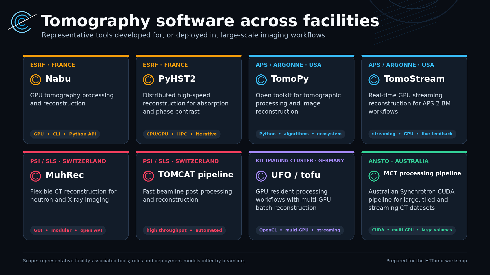
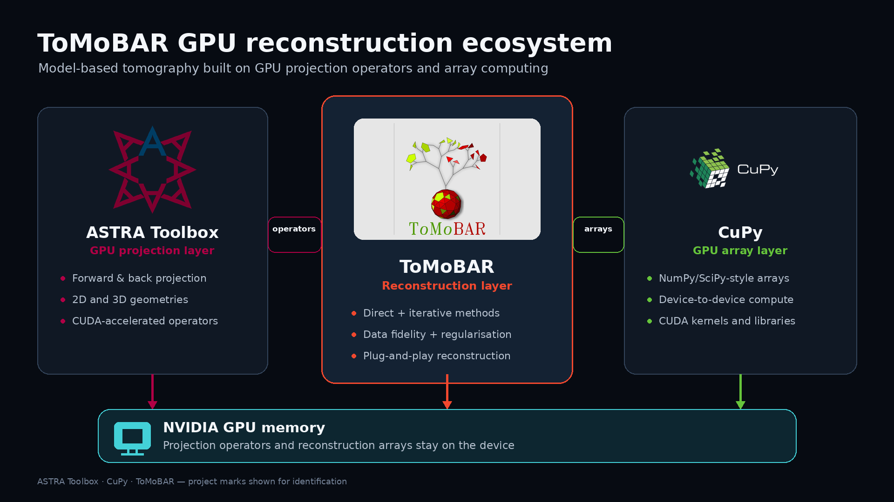

## Workshop agenda {.smaller}

| Time | Session |
|:---|:---|
| **09:00–09:05** | Welcome and objectives |
| **09:05–09:35** | **HTTomo framework** — concepts and workflow |
| **09:35–10:25** | **Getting started** — installation, tests and real-data demonstrations |
| **10:25–10:45** | ☕ **Break** |
| **10:45–11:30** | **Data and pipelines** — loaders, preview, corrections, scans, sweeps and outputs |
| **11:30–12:00** | **GPU processing** — acceleration and advanced pipelines |

## Workshop objectives

By the end of this session, you will be able to:

- understand the HTTomo's framework, key concepts, and workflow 
- configure processing pipelines for CPU and GPU
- load and preview tomography data
- run CPU or/and GPU pipelines
- perform parameter sweeps
- inspect logs, snapshots and intermediate results

---

## 

{
  width=100%
  fig-alt="Examples of tomography software associated with ESRF, APS and PSI"
}

## What is HTTomo?

:::: {.columns}

::: {.column width="27%"}
{width=90% fig-alt="HTTomo logo"}
:::

::: {.column width="68%"}

### Designed for high-throughput tomography

- **Scalable processing** for increasingly large datasets
- **In-memory GPU computation** with fewer host–device transfers
- **Plug-and-play methods** using established libraries such as TomoPy
- **Independent and replaceable user-interface layer**
- **Modern Python implementation** using current libraries and language features


:::

::::


## 

{
  width=100%
  fig-alt="ToMoBAR ecosystem integrating ASTRA Toolbox projection operators and CuPy GPU arrays"
}

## A simple HTTomo workflow

1. Prepare the input dataset
2. Select or create a YAML pipeline
3. Run HTTomo
4. Inspect the reconstructed volume

## Example pipeline

```yaml
- method: normalize
  module_path: httomolibgpu.prep.normalize
  parameters:
    cutoff: 10.0

- method: minus_log
  module_path: httomolibgpu.prep.normalize
  parameters:
    pattern: PROJECTION
```

## Running the pipeline

```bash
httomo run \
  pipeline.yaml \
  input_data.nxs \
  output/
```

## Projection normalisation

The flat- and dark-field correction is

$$
I_{\mathrm{norm}}
=
\frac{I-I_{\mathrm{dark}}}
     {I_{\mathrm{flat}}-I_{\mathrm{dark}}}.
$$

## Example image

{width=70%}