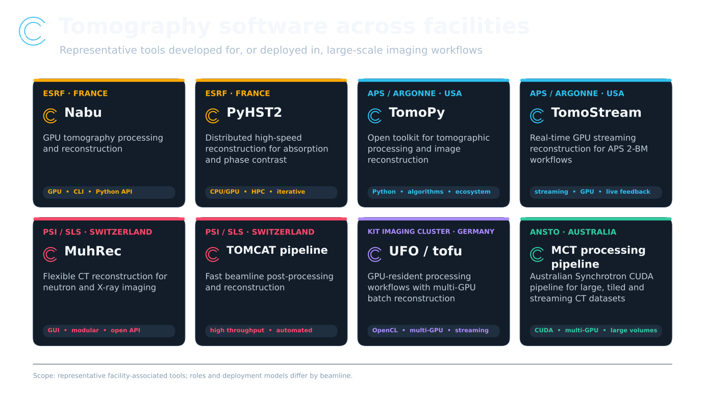
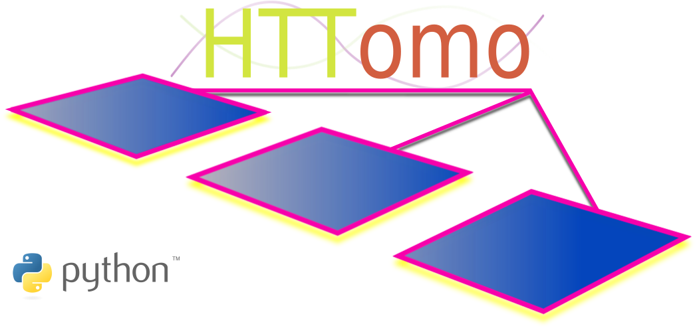
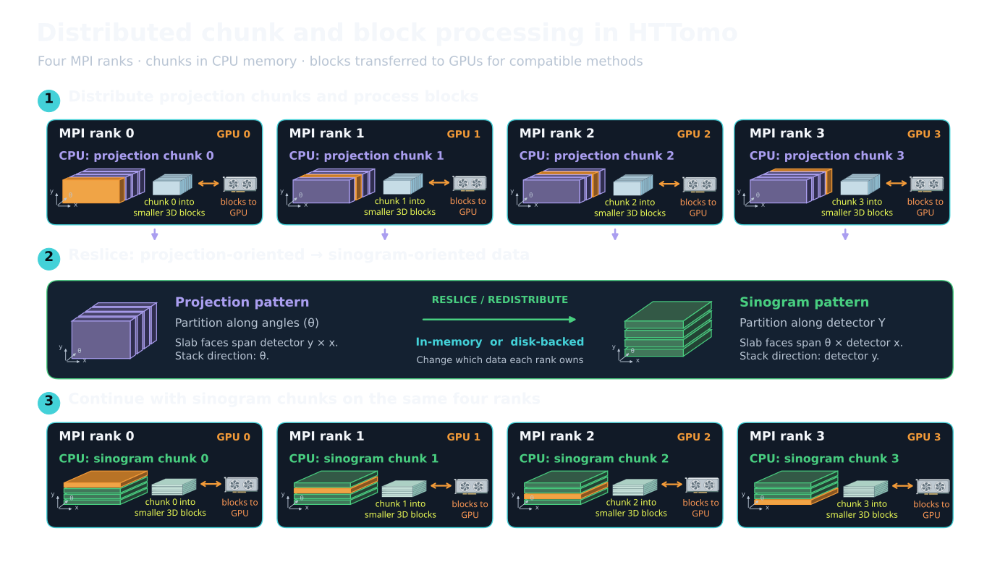
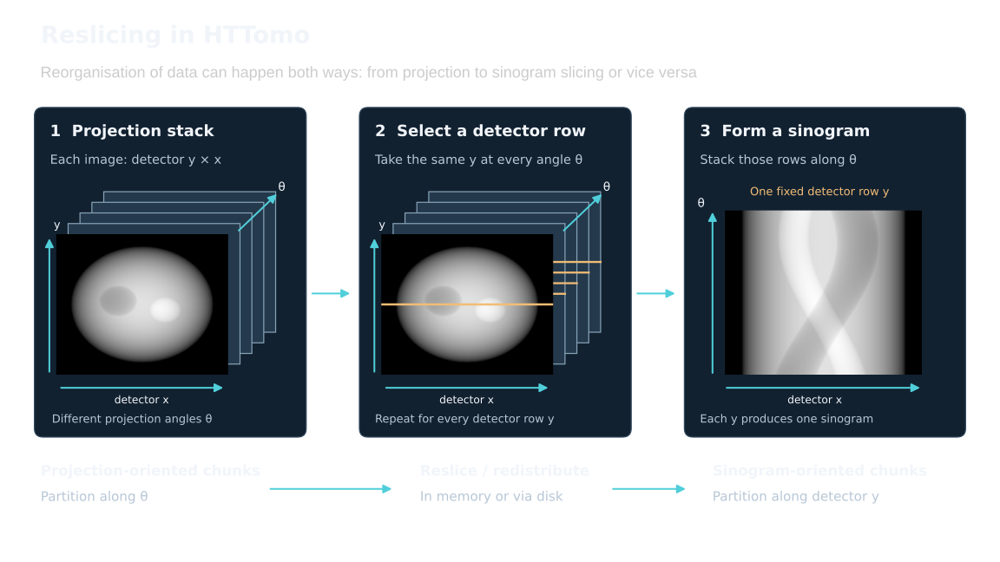
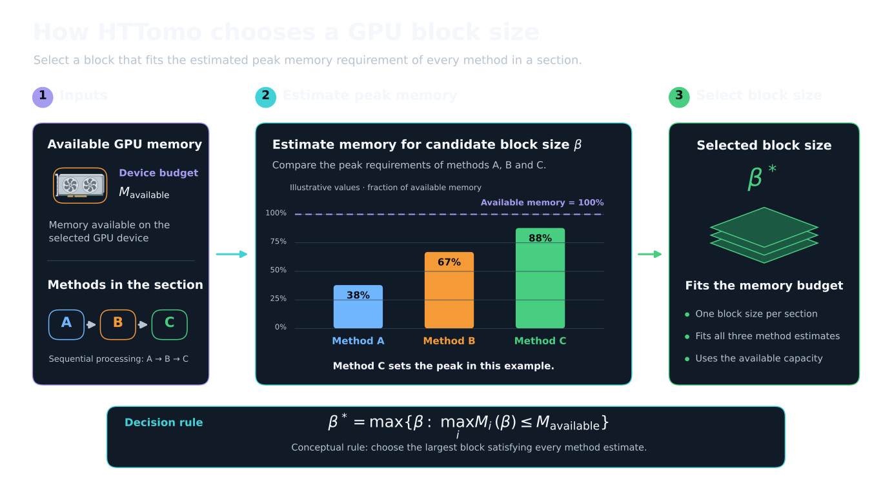
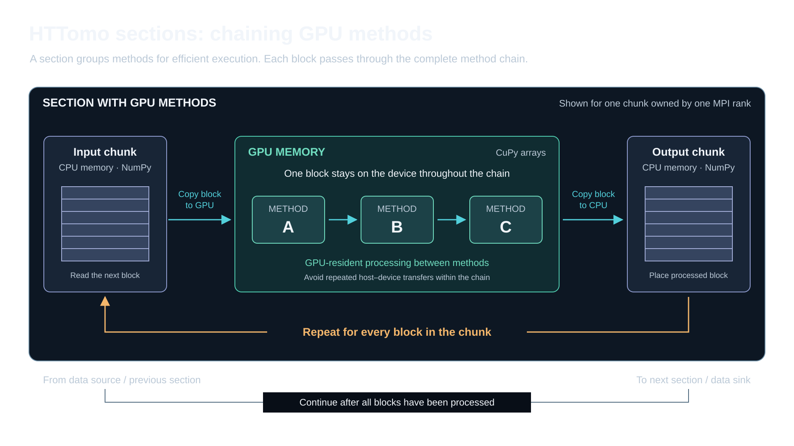
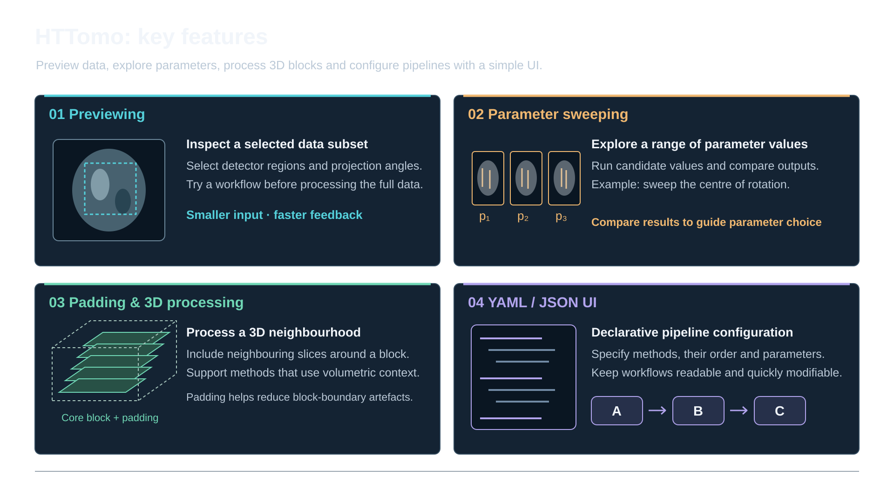
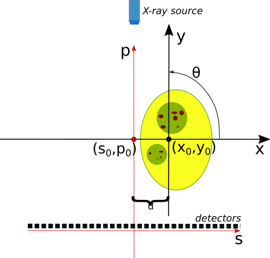

## Workshop agenda {.smaller}

| Time | Session |
|:---|:---|
| **09:00–09:05** | Welcome and objectives |
| **09:05–09:20** | **Getting started** — installation, tests run |
| **09:20–09:45** | **HTTomo framework** — concepts and workflow |
| **09:45–10:25** | **Loaders and preprocessors** — loaders, preview, pre-processing |
| **10:25–10:45** | ☕ **Break** |
| **10:45–11:30** | **Reconstruction, real data** — reconstruction, centering, sweeps and outputs |
| **11:30–12:00** | **GPU processing** — acceleration and advanced pipelines |

## Workshop objectives

By the end of this session, you will be able to:

- understand the HTTomo's framework, key concepts, and workflow 
- configure processing pipelines for CPU and GPU
- load and preview tomography data
- run CPU or/and GPU pipelines
- perform parameter sweeps
- inspect logs, snapshots and intermediate results

---

## 

{
  width=100%
  fig-alt="DLS"
}

## 

{
  width=100%
  fig-alt="Examples of tomography software associated with ESRF, APS and PSI"
}

## What is HTTomo?

:::: {.columns}

::: {.column width="27%"}
{width=90% fig-alt="HTTomo logo"}
:::

::: {.column width="68%"}

### Designed for high-throughput tomography

- **Scalable processing** for increasingly large datasets
- **In-memory GPU computation** with fewer host–device transfers
- **Plug-and-play methods** using established libraries such as TomoPy
- **Independent and replaceable user-interface layer**
- **Modern Python implementation** using current libraries and language features


:::

::::

## Installation of HTTomo and its dependencies 


{.nostretch fig-align="center" width="30%"}

## Choose your installation path

:::: {.columns}

::: {.column width="33%"}
### Linux + NVIDIA GPU

**Full HTTomo installation**

- Conda environment recommended
- CUDA/GPU methods available
- TomoPy is optional
:::

::: {.column width="33%"}
### Windows 10/11

**Run inside WSL**

- HTTomo requires Linux
- WSL supports NVIDIA CUDA GPUs
- Follow the Linux installation in WSL
:::

::: {.column width="33%"}
### Apple Silicon

**CPU-only installation**

- No NVIDIA CUDA support
- Use TomoPy/CPU methods
- Native `arm64` environment
:::

::::

::: {.callout-note}
[Complete installation guide](https://diamondlightsource.github.io/httomo/howto/installation.html)
:::

## Linux: create HTTomo conda environment {.small}

```bash
conda create --name httomo
conda activate httomo
```

Install the compiled dependencies from conda-forge:

```bash
conda install -c conda-forge \
  cupy==14.2 openmpi==4.1.6 'h5py[build=*openmpi*]' \
  python numpy astra-toolbox aiofiles click graypy loguru nvtx \
  pillow pyyaml scikit-image scipy tqdm hdf5plugin pip pywavelets
```

Install TomoPy for CPU processing:

```bash
conda install -c conda-forge tomopy==1.15.3
```

Install HTTomo and its processing libraries:

```bash
pip install httomo httomo-backends httomolib \
  httomolibgpu tomobar --no-deps
```

Then verify the command-line interface:

```bash
python -m httomo --help
```

::: {.callout-tip}
If you don't have a GPU device it is still OK to install `cupy` and `httomolibgpu` library, however, you'd need to use CPU methods from `tomopy` and `httomolib` libraries.
:::


## Windows: install through WSL

HTTomo libraries can be installed natively, but the **HTTomo framework requires Linux**.

1. Open **Windows Terminal as Administrator**.
2. Install WSL and reboot:

   ```powershell
   wsl --install
   ```

3. Start the Linux environment:

   ```powershell
   wsl
   ```

4. Inside WSL, install the **Linux Miniforge** distribution.
5. Follow the Linux/conda installation from the previous slides.

::: {.callout-note}
WSL supports compatible NVIDIA CUDA GPUs. If `httomolib` needs a compiler, run `sudo apt-get install gcc` inside WSL.
:::

## macOS Apple Silicon: CPU-only {.small}

Install native `arm64` Miniforge—not the Intel/Rosetta build:

```bash
curl -L -O https://github.com/conda-forge/miniforge/releases/latest/download/Miniforge3-MacOSX-arm64.sh
bash Miniforge3-MacOSX-arm64.sh
```

Create the environment and install CPU dependencies:

```bash
conda create --name httomo python=3.11
conda activate httomo

conda install -c conda-forge "numpy<2" mpi4py openmpi==4.1.6 \
  "h5py=*=mpi_openmpi*" astra-toolbox tomopy==1.15.3 \
  aiofiles click graypy loguru nvtx pillow pyyaml \
  scikit-image scipy tqdm hdf5plugin pywavelets

conda install -c conda-forge compilers llvm-openmp
pip install httomo httomo-backends httomolib tomobar --no-deps
```

::: {.callout-warning}
Do not install CuPy or `httomolibgpu`: Apple Silicon does not support NVIDIA CUDA. Pipelines must use CPU/TomoPy methods.
:::

## Verify the installation

Check that HTTomo starts:

```bash
python -m httomo --help
```

For CUDA-enabled Linux or WSL installations:

```bash
nvidia-smi
python -c "import cupy; print(cupy.cuda.runtime.getDeviceCount())"
```

For macOS, confirm that HDF5 has MPI support:

```bash
python -c "import h5py; print(h5py.get_config().mpi)"
```

Expected result: `True`

## Optional: run the HTTomo tests {.small}

```bash
git clone https://github.com/DiamondLightSource/httomo.git
cd httomo

conda install -c conda-forge \
  pytest pytest-cov pytest-xdist pytest-mock plumbum
```

CPU tests:

```bash
pytest tests/
```

GPU tests—CUDA-enabled systems only:

```bash
pytest tests/ --cupy
```

::: {.callout-note}
The small-data pipeline tests are available with `pytest tests/ --small_data` after downloading the example pipelines described in the [testing guide](https://diamondlightsource.github.io/httomo/howto/running_tests.html).
:::

## Installation complete

You should now have:

- an isolated `httomo` conda environment;
- MPI and parallel HDF5 support;
- GPU processing on Linux/WSL, where CUDA is available;
- CPU/TomoPy processing on Apple Silicon;
- a working `python -m httomo` command.


## HTTomo framework (main concepts)

## {#mpi_figure}

{
  width=100%
  fig-alt="HTTomo inner workings: MPI chunks, reslice and oriented projections"
}

::: {.footer}
[Benefits of using Open MPI in HTTomo](#openmpi-benefits )
:::

## 

{
  width=100%
  fig-alt="HTTomo reslicing"
}


## 

{
  width=100%
  fig-alt="GPU memory estimation for HTTomo"
}


## 

{
  width=100%
  fig-alt="HTTomo sections"
}


## 

<object data="images/httomo_wrappers.svg"
        type="image/svg+xml"
        style="display:block; width:100%; aspect-ratio:16/9; margin:auto;">
</object>

::: {.footer}
[Enabling own methods in HTTomo](#own_methods)
:::


## 

<object data="images/gpu_reconstruction_httomo.svg"
        type="image/svg+xml"
        style="display:block; width:100%; aspect-ratio:16/9; margin:auto;">
</object>

## 

{
  width=100%
  fig-alt="HTTomo features"
}

## Loaders and preprocessors

1. Prepeare tomography datasets: synthetic and real data
2. Create a YAML pipeline with the loader and preprocessor methods
3. Modify the preview 
3. Run HTTomo
4. Inspect the correction results

## NXtomo data generation with TomoPhantom {.smaller}

::: {.columns}
::: {.column width="48%"}
### 1. Install TomoPhantom

Install into your HTTomo conda environemnt:

```bash
conda install -c httomo -c conda-forge \
  tomophantom==3.1.5 h5py psutil scikit-image
```

Save bellow as**`artefacts.json`** in your working directory (e.g., `synthdata`):
```json
{
  "zingers_percentage": 0.05,
  "zingers_modulus": 10,
  "stripes_percentage": 3.0,
  "stripes_maxthickness": 3,
  "stripes_intensity": 0.05,
  "stripes_type": "full",
  "stripes_variability": 0.002,
  "verbose": true
}
```
Save bellow as **`flat_settings.json`** :
```json
{
  "detectors_miscallibration": 0.05,
  "variations_number": 3,
  "arguments_Bessel": [1, 25],
  "specklesize": 2,
  "kbar": 2,
  "sigmasmooth": 3,
  "jitter_projections": 0.0
}
```

:::

::: {.column width="52%"}
### 2. Generate synthethic data

From the command line and from the `synthdata` folder run the following command:

```bash
python -m tomophantom.scripts.nxs_generator \ 
  --realistic -m 18 -s 256 512 740 \ 
  --flats 20 --darks 10 --source-intensity 20000 \
  --artefacts artefacts.json \
  --flat-settings flat_settings.json \ 
  --seed 1 -o tomodata_synth.nxs
```

**Output:** `tomodata_synth.nxs` in your working directory, containing darks, flats and projections.

Use [myhdf5](https://myhdf5.hdfgroup.org/) online viewer to inspect the generated NeXus/HDF5 file.

::: {.callout-note}
One can also generate a smaller dataset if needed by changing the shape parameter in the command above, e.g., `-s 128 256 362`.
:::

:::
:::

::: {.footer}
[TomoPhantom Installation guide](https://dkazanc.github.io/TomoPhantom/) ·
[Generator script](https://github.com/dkazanc/TomoPhantom/blob/master/tomophantom/scripts/nxs_generator.py)
:::

## HTTomo loader and data previewing {.smaller}

::: {.columns}
::: {.column width="49%"}
###  YAML for HTTomo loader

```yaml
- method: standard_tomo
  module_path: httomo.data.hdf.loaders
  parameters:
    data_path: auto # 'auto' key for NXtomo standard
    image_key_path: auto
    rotation_angles: auto
    preview:
      detector_x: # horizontal cropping
        start: null
        stop: null
      detector_y: # vertical cropping
        start: null
        stop: null
    darks: null
    flats: null
```
::: {.callout-note}
See [HTTomo loader](https://diamondlightsource.github.io/httomo/reference/loaders.html) documentation for more details.
:::


:::

::: {.column width="51%"}
### Previewing

[Data previewing](https://diamondlightsource.github.io/httomo/howto/httomo_features/previewing.html) **crops data during loading** to reduce processing time and/or test parameters.

- Data axes: **(angles, detector_y, detector_x)**.
- Use `null`: to keep the full dimension.
- Ranges use zero-based indices.

Examples:

```yaml
  preview:
    detector_y:
      start: 50
      stop: 100
```

or use `mid` keyword to select the middle part:

```yaml
  preview:
    detector_y:
      start: mid
      start_offset : -10
      stop: mid
      stop_offset : 10
```

:::

:::


## Building HTTomo pipeline with YAML templates {.smaller}

::: {.columns}
::: {.column width="49%"}
### Finding and copying a method

1. Open [Methods YAML Templates](https://diamondlightsource.github.io/httomo/backends/templates.html). See the **latest** templates.
2. Select a library and a module, then find the method. Copy its **YAML block** or use **Download**.
3. Paste into **YAML pipeline** after the loader. Keep method entries aligned.

::: {.callout-note}
Use the editors that support YAML syntax highlighting, e.g., vscodium, VSCode, Atom, PyCharm and others.
:::

4. Edit parameters, replace any `REQUIRED` values, and run [YAML checker](https://diamondlightsource.github.io/httomo/utilities/yaml_checker.html) before processing to validate the resulting YAMl.

:::

::: {.column width="51%"}
### Example: adding preprocessing

From [HTTomolibgpu normalization templates](https://diamondlightsource.github.io/httomo-backends/api/httomolibgpu.prep.normalize.html), paste these blocks **after your loader**:

```yaml
# Existing loader stays above these methods.
- method: dark_flat_field_correction
  module_path: httomolibgpu.prep.normalize
  parameters:
    flats_multiplier: 1.0
    darks_multiplier: 1.0
    upper_bound: null
    lower_bound: null

- method: minus_log
  module_path: httomolibgpu.prep.normalize
  parameters: {}
```

::: {.callout-warning}
The methods from the [HTTomolibgpu](https://github.com/DiamondLightSource/httomolibgpu) library use the GPU backend.
:::

:::
:::

## Exercise 1: pre-processing (d/f correction) {.smaller}

::: {.columns}
::: {.column width="49%"}
### Your task ~ 7 minutes

Use the generated **synthetic transmission data** `tomodata_synth.nxs`, to correct for flats and darks.

1. Save your loader configuration as `pipeline_synth.yaml`. Select a small vertical preview (e.g., 10 rows/slices).
2. Copy **normalize**, then **minus_log** from the [TomoPy YAML templates](https://diamondlightsource.github.io/httomo-backends/api/tomopy.prep.normalize.html) below the loader.
3. Add [saving](https://diamondlightsource.github.io/httomo/howto/process_lists/save_results/save_results.html#example-1-save-output-of-a-specific-method) the result of **minus_log** into the HDF5 file.
4. Validate the YAML file with [YAML checker](https:/K/diamondlightsource.github.io/httomo/utilities/yaml_checker.html):
```bash
python -m httomo check pipeline_synth.yaml tomodata_synth.nxs
```
5. Run the pipeline with:
```bash
python -m httomo run pipeline_synth.yaml tomodata_synth.nxs output/
```
6. Inspect the results with [myhdf5](https://myhdf5.hdfgroup.org/) or any HDF5 viewer.
:::

::: {.column width="51%"}
### What are these operations?

**1. Dark/flat correction** estimates transmission:

$$T = \frac{I-D}{F-D}$$

$I$: sample image. $D$: mean dark, beam off. $F$: mean flat, beam on without the sample.

Subtracting $D$ removes detector offset. Dividing by $F-D$ corrects illumination and pixel-response variations.

**2. Negative log** gives an attenuation projection:

$$p=-\ln T \approx \int_{\mathrm{ray}}\mu(s)\,ds$$

The Beer–Lambert model converts transmission into the line integrals used in reconstruction.

:::
:::


## Exercise 2: pre-processing (dezingering) {.smaller}

::: {.columns}
::: {.column width="49%"}
### Your task ~ 5 minutes

Use `tomodata_synth.nxs` to remove zingers (outliers) from the projections.

1. Use `pipeline_synth.yaml` from Exercise 1 to add **zinger removal** method using the TomoPy's [remove_outlier3d](https://tomopy.readthedocs.io/en/stable/_modules/tomopy/misc/corr.html#remove_outlier3d). 
2. Add the appropriate [TomoPy YAML template](https://diamondlightsource.github.io/httomo-backends/api/tomopy.misc.corr.html) right after the loader and before any other method.
3. Add [saving](https://diamondlightsource.github.io/httomo/howto/process_lists/save_results/save_results.html#example-1-save-output-of-a-specific-method) the result of **remove_outlier3d** into the HDF5 file.
4. Validate the YAML file with [YAML checker](https:/K/diamondlightsource.github.io/httomo/utilities/yaml_checker.html):
```bash
python -m httomo check pipeline_synth.yaml tomodata_synth.nxs
```
5. Run the pipeline with:
```bash
python -m httomo run pipeline_synth.yaml tomodata_synth.nxs output/
```
6. Inspect the results with [myhdf5](https://myhdf5.hdfgroup.org/) or any HDF5 viewer. As to compare data before and after filtering.
:::

::: {.column width="51%"}
### What is this operation?

A **zinger** is a spurious, isolated intensity spike or small cluster of pixels. A **dezinger** method detects and replaces these outliers.

**Origin:** cosmic rays or scattered X-rays can strike the camera sensor directly, depositing much more energy than the normal scintillator light signal.

### TomoPy's `remove_outlier3d`

Uses a **local 3D median** to selectively replace outliers, retaining other values.

- **`size: 3`** uses a 3 × 3 × 3 neighbourhood across the projection stack.
- **`dif`** controls the difference threshold in the input data's intensity units.

::: {.smaller}
A threshold that is too low can remove real detail (equivalent to running a median filter). 
:::
:::
:::

::: {.footer}
[Zinger origins](https://www.mcs.anl.gov/research/projects/X-ray-cmt/rivers/tutorial.html)
:::


## Exercise 3: pre-processing (de-stripe) {.smaller}

::: {.columns}
::: {.column width="49%"}
### Your task ~ 7 minutes

Use `tomodata_synth.nxs` to remove stripes from the sinograms.

1. Use `pipeline_synth.yaml` from Exercises 1-2 and add a **stripe removal** method from TomoPy's [selection](https://tomopy.readthedocs.io/en/stable/api/tomopy.prep.stripe.html). 
2. Add the appropriate [TomoPy YAML template](https://diamondlightsource.github.io/httomo-backends/api/tomopy.prep.stripe.html) after all methods.
3. Add [saving](https://diamondlightsource.github.io/httomo/howto/process_lists/save_results/save_results.html#example-1-save-output-of-a-specific-method) the result of **stripe removal** method into the HDF5 file.
4. Validate the YAML file with [YAML checker](https:/K/diamondlightsource.github.io/httomo/utilities/yaml_checker.html):
```bash
python -m httomo check pipeline_synth.yaml tomodata_synth.nxs
```
5. Run the pipeline with:
```bash
python -m httomo run pipeline_synth.yaml tomodata_synth.nxs output/
```
6. Inspect the results with [myhdf5](https://myhdf5.hdfgroup.org/) or any HDF5 viewer. As to compare data before and after filtering.
:::

::: {.column width="51%"}
### What is this for?

Residual detector-response errors, defective pixels or changing flat fields can leave intensity errors at fixed detector positions across many projections.

These form **stripes in sinograms** and **rings in reconstructed slices**.

### Methods to compare

TomoPy [provides](https://tomopy.readthedocs.io/en/stable/api/tomopy.prep.stripe.html) several methods to remove stripes, some to try:
- **`remove_stripe_fw`**: Fourier–wavelet filtering of stripe patterns.
- **`remove_stripe_based_sorting`**: sorting-based correction of full and partial stripes.
- **`remove_all_stripe`**: combines approaches for several stripe types, including large and unresponsive stripes.


:::
:::

::: {.footer}
[Stripe/ring artefacts guide](https://sarepy.readthedocs.io)
:::

## Reconstruction, centering, features

1. Reconstructing: synthetic and real data
2. Using the **center of rotation** finding methods
3. Parameter sweeps
3. Images and snapshot saving
4. Inspecting the logs


## Exercise 4: reconstruction {.smaller}

::: {.columns}
::: {.column width="49%"}
### Your task ~ 7 minutes

Reconstructing `tomodata_synth.nxs` after pre-processing.

1. Use `pipeline_synth.yaml` from Exercises 1-3 and add a [reconstruction](https://tomopy.readthedocs.io/en/stable/api/tomopy.recon.algorithm.html) module from TomoPy. 
2. Add the following reconstruction YAML template after all methods.
```yaml
- method: recon
  module_path: tomopy.recon.algorithm
  parameters:
    center: null # assumption of the centered data
    sinogram_order: false
    algorithm: gridrec # selecting Gridrec algorithm
    filter_name: shepp # Shepp-Logan filter
    init_recon: null
```
3. Validate the YAML file with [YAML checker](https:/K/diamondlightsource.github.io/httomo/utilities/yaml_checker.html):
```bash
python -m httomo check pipeline_synth.yaml tomodata_synth.nxs
```
4. Run the pipeline with:
```bash
python -m httomo run pipeline_synth.yaml tomodata_synth.nxs output/
```
6. Inspect the results with [myhdf5](https://myhdf5.hdfgroup.org/) or any HDF5 viewer.
:::

::: {.column width="51%"}
### What is this for?

After correction and negative log, each ray measures a **line integral of attenuation**:

$$p_\theta(s)=\int_{\mathrm{ray}(\theta,s)}\mu(x,y)\,d\ell$$

Reconstruction estimates **$\mu(x,y)$** from projections at many angles and parallel-beam data normally span **180°**, with sufficient angular sampling.

TomoPy's **`gridrec`** is based on **Fourier slice theorem:** the 1D Fourier transform of a projection gives a radial line in the slice's 2D Fourier transform.

**`gridrec`** maps these Fourier samples onto a grid and inverts the transform. Reconstruction filters control the balance between resolution and noise.

:::

::: {.footer}
[Stripe/ring artefacts guide](https://sarepy.readthedocs.io)
:::

:::


## Switch off dezinger and destripper 

One can switch off dezinger and destripper to see the effect of these methods on the reconstruction.

<details>
<summary>YAML pipeline</summary>


```yaml
# --- Standard tomography loader for NeXus files. ---
- method: standard_tomo
  module_path: httomo.data.hdf.loaders
  parameters:
    data_path: auto
    image_key_path: auto
    rotation_angles: auto
    preview:
      detector_x:   # horizontal data previewing/cropping.
        # when null, the full data dimension is used, i.e., no previewing
        start: null
        stop: null
      detector_y:
        start: mid
        start_offset : -10
        stop: mid
        stop_offset : 10    
    darks: null
    flats: null
# - method: remove_outlier3d
#   module_path: tomopy.misc.corr
#   parameters:
#     dif: 10000
#     size: 3  
- method: normalize
  module_path: tomopy.prep.normalize
  parameters:
    cutoff: null
    averaging: mean
# - method: remove_stripe_fw
#   module_path: tomopy.prep.stripe
#   parameters:
#     level: null
#     wname: db5
#     sigma: 2
#     pad: true
- method: minus_log
  module_path: tomopy.prep.normalize
  parameters: {}
- method: recon
  module_path: tomopy.recon.algorithm
  parameters:
    center: null
    sinogram_order: false
    algorithm: gridrec
    filter_name: shepp
    init_recon: null
```
</details>


## GPU YAML pipeline for synthetic data

::: {.callout-warning}
This pipeline is for **CUDA-enabled Linux or WSL** installations. It uses the GPU backend from the `httomolibgpu` library. 
:::

<details>
<summary>YAML GPU pipeline</summary>


```yaml
# --- Standard tomography loader for NeXus files. ---
- method: standard_tomo
  module_path: httomo.data.hdf.loaders
  parameters:
    data_path: auto
    image_key_path: auto
    rotation_angles: auto
    preview:
      detector_x:   # horizontal data previewing/cropping.
        # when null, the full data dimension is used, i.e., no previewing
        start: null
        stop: null
      detector_y:
        start: mid
        start_offset : -10
        stop: mid
        stop_offset : 10    
    darks: null
    flats: null
# --- Removing unresponsive/dead pixels in the data, aka zingers. Use if sharp streaks are present in the reconstruction. To be applied before normalisation. ---
- method: remove_outlier
  module_path: httomolibgpu.misc.corr
  parameters:
    kernel_size: 3  # The size of the 3D neighbourhood surrounding the voxel. Odd integer.
    dif: 1000 # A difference between the outlier value and the median value of neighbouring pixels.
# --- Normalisation of projection data using collected flats/darks images. --- 
- method: dark_flat_field_correction
  module_path: httomolibgpu.prep.normalize
  parameters:
    flats_multiplier: 1.0
    upper_bound: null
    lower_bound: null
- method: minus_log
  module_path: httomolibgpu.prep.normalize
  parameters: {}
# --- stripe removal method. ---  
- method: remove_stripe_fw
  module_path: httomolibgpu.prep.stripe
  parameters:
    sigma: 2
    wname: db5
    level: null  
# --- Reconstruction method. ---
- method: LPRec3d_tomobar
  module_path: httomolibgpu.recon.algorithm
  parameters:
    center: null
    detector_pad: false # Horizontal detector padding to minimise circle/arc-type artifacts in the reconstruction. Set to 'true' to enable automatic padding or an integer
    filter_type: shepp
    filter_freq_cutoff: 1.0
    recon_size: null
    recon_mask_radius: 0.95 
```
</details>

## Download real raw data from TomoBank {#real_data .smaller}

:::: {.columns}

::: {.column width="43%"}

### 1. Download the data
- [Download](https://www.swisstransfer.com/dl/01a0a9f5-b9a7-72a6-b225-7ca3eba87caa) the [TomoBank Lorentz dataset](https://tomobank.readthedocs.io/en/latest/source/data/docs.data.lorentz.html) as the **`tomo_00088.h5`** file to your workshop folder .

### 2. Configure the loader

Copy the loader on the right to your new pipeline, e.g., `pipeline_tomo88.yaml`. 

::: {.callout-note}
As the file `tomo_00088.h5` doesn't comply with the NXTomo standard, there is a change of the paths to data within the file. We need to explicitly specify the paths to projections, darks and flats datasets.

We also need to specify the rotation angles as the dataset doesn't contain them. The angles are known from the experiment.
:::

:::

::: {.column width="57%"}

```{.yaml code-font-size="0.55em"}
- method: standard_tomo
  module_path: httomo.data.hdf.loaders
  parameters:
    data_path: /exchange/data
    image_key_path: null # no keys in the dataset
    rotation_angles:
      user_defined:
        start_angle: 0
        stop_angle: 179.876
        angles_total: 1500
    preview:
      detector_y:
        start: mid
        start_offset : -10
        stop: mid
        stop_offset : 10
    darks:
      file: input_data 
      image_key_path: null
      data_path: /exchange/data_dark
    flats:
      file: input_data
      image_key_path: null
      data_path: /exchange/data_white
    continuous_scan_subset: null
```

:::

::::

::: {.footer}
[HTTomo real data example](https://diamondlightsource.github.io/httomo/howto/how_to_run/real_data_example.html)
:::


## Centre of Rotation (CoR) estimation {.smaller}

::: {.columns}
::: {.column width="50%"}
### Background on CoR

::: {style="text-align: center;"}
{
  width=63%
  fig-alt="The issue of CoR"
}
:::

The CoR parameter can be defined as a distance $d$ that translates the coordinate system $(x,y)$ of the scanned object to the coordinate system $(s,p)$ of the acquisition device. This leads to a simple linear mapping: $(s = x \pm d, p = y)$.

$d$ - should be established either experimentally or computationally. 

:::

::: {.column width="50%"}
### Methods for CoR estimation

In HTTomo, the CoR can be estimated by using:

1. Methods that rely on the rotational symmetry of a sinogram (e.g., [Find center by N.Vo](#cor-search)) or alignment of projections ([Phase cross-correlation](https://tomopy.readthedocs.io/en/stable/api/tomopy.recon.rotation.html#tomopy.recon.rotation.find_center_pc)).
2. Methods evaluating quality metrics of the reconstruction: [metrics-based finder](https://tomopy.readthedocs.io/en/stable/api/tomopy.recon.rotation.html#tomopy.recon.rotation.find_center)
3. Feature that perform manual search through the [sweeping functionality](#sweeping) in HTTomo. 

:::

:::

::: {.footer}
[Details on CoR](https://diamondlightsource.github.io/httomo/howto/httomo_features/centering.html)
:::

## Finding the center of rotation using N.Vo method {#cor-search}

<video data-autoplay loop muted playsinline controls preload="auto" poster="images/cor-search-poster.png" style="display:block; width:90%; margin:0 auto;">
<source src="images/cor-search.mp4" type="video/mp4">
</video>

::: {style="font-size: 0.5em;"}
Synthetic demonstration inspired by [Vo et al., Optics Express 22, 19078–19086 (2014)](https://doi.org/10.1364/OE.22.019078). In TomoPy: [`find_center_vo`](https://tomopy.readthedocs.io/en/stable/api/tomopy.recon.rotation.html#tomopy.recon.rotation.find_center_vo).
:::


## Side outputs {#side-outputs .smaller}

A [side-output](https://diamondlightsource.github.io/httomo/howto/process_lists/side_outputs/side_out.html#side-output) is an additional result that certain methods expose for use by later methods. 

Example: [HTTomo auto-centering](https://diamondlightsource.github.io/httomo/howto/httomo_features/centering.html#auto-centering) produces a **centre-of-rotation value** that reconstruction uses automatically.

:::: {.columns}
::: {.column width="55%"}

### Using side outputs in YAML

```{.yaml code-line-numbers="12-14|20"}
# After pre-processing: estimate the CoR
- method: find_center_vo
  module_path: httomolibgpu.recon.rotation
  parameters:
    ind: mid
    smin: -50
    smax: 50
    srad: 6
    step: 0.25
    ratio: 0.5
    drop: 20
  id: centering
  side_outputs:
    cor: centre_of_rotation

# Reconstruction using the estimated CoR
- method: FBP3d_tomobar
  module_path: httomolibgpu.recon.algorithm
  parameters:
    center: ${{centering.side_outputs.centre_of_rotation}}
    filter_freq_cutoff: 1.1
    recon_size: null
    recon_mask_radius: null
```

:::
::: {.column width="45%"}

### How the reference works

1. **Identify the producer**  
   `id: centering` names this method instance.

2. **Name its result**  
   `cor` is the exposed output key.  
   `centre_of_rotation` is the name you assign to it.

3. **Use it as a parameter**  
   `${{…}}` tells HTTomo to resolve the reference at runtime and supply the calculated value to `center`.

::: {.callout-note}
**Method order matters:** place auto-centering before reconstruction but after preprocessing (e.g., d/f correction).
:::

:::
::::


## Exercise 5: reconstruction with auto-centering {.small}

### Your task ~ 7 minutes

Use real data `tomo_00088.h5` to perform d/f correction, auto-centering and reconstruction.

1. Use `pipeline_tomo88.yaml` with the specific [loader](#real_data). 
2. Add the [`find_center_vo`](https://tomopy.readthedocs.io/en/stable/api/tomopy.recon.rotation.html#tomopy.recon.rotation.find_center_vo) method by using the [YAML template](https://diamondlightsource.github.io/httomo-backends/api/tomopy.recon.rotation.html) for it.
3. Add the `gridrec` reconstruction method using provided [YAML template](https://diamondlightsource.github.io/httomo-backends/api/tomopy.recon.algorithm.html).

::: {.callout-note}
Note that `center` in `parameters` points to the side output of the `find_center_vo` method by default.
```{.yaml code-line-numbers="2"}
  parameters:
    center: ${{centering.side_outputs.centre_of_rotation}}
    sinogram_order: false
    algorithm: gridrec
```
:::

4. Validate the YAML file and run the pipeline.

## Why use Open MPI in HTTomo? {#openmpi-benefits .smaller}

**Open MPI** is an open-source implementation of the **Message Passing Interface (MPI)**. It launches cooperating processes, called **ranks**, and lets them exchange data on one computer or across cluster nodes.


### Benefits for tomography

| Benefit | How HTTomo uses it |
|:--|:--|
| **Shorter processing time** | Ranks process different projections or reconstruct different slices concurrently. |
| **Distributed data** | Each rank handles a portion of the main dataset. Multiple nodes provide access to more aggregate RAM. |
| **Data exchange** | MPI enables redistribution between projection and sinogram processing patterns. |
| **Flexible deployment** | Run a pipeline on a workstation or on allocated cluster resources. |

Parallel-beam tomography offers substantial **data parallelism** as operations can run independently on different projections or sinograms.

::: {.footer}
[Data distribution in HTTomo figure](#mpi_figure)
:::


## Sweeping functionality {#sweeping .smaller}

## Parallel processing in HTTomo with MPI {.smaller}

::: {.columns}
::: {.column width="49%"}
### Running the same pipeline in parallel

Activate your HTTomo environment, then launch **four MPI processes**:

```bash
mpirun -np 4 python -m httomo run \
  phantom.nxs pipeline.yaml output_mpi4/
```

- `-np 4`: four cooperating processes, or **ranks**.
- `phantom.nxs`: input data.
- `pipeline.yaml`: your existing method sequence.
- `output_mpi4/`: output directory.

**One-process baseline:**

```bash
mpirun -np 1 python -m httomo run \
  phantom.nxs pipeline.yaml output_mpi1/
```

::: {.smaller}
MPI can run on one machine or allocated cluster nodes. Use the MPI launcher compatible with your HTTomo environment.
:::
:::

::: {.column width="51%"}
### Why it can scale well

**Share the data:** ranks work on different portions of the volume. Many projection operations and slice reconstructions can run concurrently.

**Match the method:** HTTomo redistributes data when processing changes between projection and sinogram access patterns.

**Keep useful work large:** sufficiently large datasets give each rank enough computation to outweigh communication and startup costs.

### Measuring the benefit

$$S_N=\frac{T_1}{T_N}$$

Ideal speedup is $N$; actual gains depend on disk I/O, communication and workload size.

::: {.smaller}
**Try 1, 2 and 4 ranks.** Keep data and YAML fixed. Budget CPU threads per rank to avoid oversubscription. Extra ranks sharing one GPU may not help.

[Running HTTomo](https://diamondlightsource.github.io/httomo/howto/how_to_run/outside_diamond.html) · [Efficient pipelines](https://diamondlightsource.github.io/httomo/howto/process_lists/process_list_configure.html)
:::
:::
:::

## Adding your own methods to HTTomo {#own_methods .smaller}


