## Workshop agenda

| Time | Session |
|:---|:---|
| **09:00–09:05** | Welcome and objectives |
| **09:05–09:20** | **Getting started** — installation, tests |
| **09:20–09:45** | **HTTomo framework** — concepts and workflow |
| **09:45–10:25** | **Loaders and preprocessors** — loaders, preview, pre-processing |
| **10:25–10:45** | ☕ **Break** |
| **10:45–11:30** | **Reconstruction, real data** — reconstruction, centering, sweeps and outputs |
| **11:30–12:00** | **Advanced concepts** — large data, GPU processing, HPC |


## Workshop objectives

By the end of this session, you will be able to:

- understand the HTTomo's framework, key concepts, and workflow 
- configure processing pipelines for CPU and GPU
- load and preview tomography data
- run CPU or/and GPU pipelines
- visualise the results
- perform parameter sweeps
- learn on more advanced concepts of HTTomo in application to GPU and HPC data processing


## 

{
  width=100%
  fig-alt="DLS"
}

::: {.footer}
[Diamond Light Source website](https://www.diamond.ac.uk/Home.html)
:::

## 

{
  width=100%
  fig-alt="Examples of tomography software associated with ESRF, APS and PSI"
}

:::{.footer}
[Tomopedia](https://tomopedia.github.io/software/)
:::


## What is HTTomo?

:::: {.columns}

::: {.column width="27%"}
{width=90% fig-alt="HTTomo logo"}
:::

::: {.column width="68%"}

### Designed for high-throughput parallel-beam tomography

- **Scalable processing** for increasingly large datasets
- **GPU computation** with fewer host–device transfers
- **Plug-and-play methods** using libraries such as TomoPy and accelerated GPU/CPU in-house libraries
- **Independent and replaceable user-interface layer**
- Built using **modern Python development** practices, including comprehensive testing, mocking, type checking, and automated quality checks.

:::
::::

::: {.footer}
[HTTomo documentation](https://diamondlightsource.github.io/httomo/)
:::

## Installation of HTTomo and its dependencies 


{.nostretch fig-align="center" width="50%"}

::: {.footer}
[HTTomo installation](https://diamondlightsource.github.io/httomo/howto/installation.html)
:::

## Choose your installation

:::: {.columns}

::: {.column width="33%"}
### [Linux + NVIDIA GPU](#linux_install)

**Full HTTomo installation**

- Conda environment recommended
- CUDA/GPU methods available
- TomoPy is optional
:::

::: {.column width="33%"}
### [Windows 10/11](#windows_install)

**Run inside WSL**

- HTTomo requires Linux
- WSL supports NVIDIA CUDA GPUs
- Follow the Linux installation in WSL
:::

::: {.column width="33%"}
### [Apple Silicon](#apple_install)

**CPU-only installation**

- No NVIDIA CUDA support
- Use TomoPy/CPU methods
- Native `arm64` environment
:::

::::

::: {.footer}
[HTTomo installation](https://diamondlightsource.github.io/httomo/howto/installation.html)
:::


## Linux: create HTTomo conda environment {#linux_install .smaller}

```{.bash}
conda create --name httomo
conda activate httomo
```

Install the dependencies from conda-forge:

```{.bash}
conda install -c conda-forge cupy==14.2 openmpi==4.1.6 h5py[build=*openmpi*] \
python numpy astra-toolbox aiofiles click graypy loguru nvtx \
pillow pyyaml scikit-image scipy tqdm hdf5plugin pip pywavelets
```

Install TomoPy for CPU processing:

```{.bash code-line-numbers="false"}
conda install -c conda-forge tomopy==1.15.3
```

Install HTTomo and libraries:

```{.bash code-line-numbers="false"}
pip install httomo httomo-backends httomolib httomolibgpu tomobar --no-deps
```

Then verify the command-line interface:

```{.bash code-line-numbers="false"}
python -m httomo --help
```

::: {.callout-note}
You can install `CuPy` and `httomolibgpu` without a GPU. However, to process data on the CPU, use methods from `TomoPy` and `httomolib`.
:::

::: {.footer}
[HTTomo Linux installation](https://diamondlightsource.github.io/httomo/howto/installation.html)
:::

## Windows: install through WSL {#windows_install}

HTTomo libraries can be installed natively, but the **HTTomo framework requires Linux**.

1. Open **Windows Terminal as Administrator**.
2. Install WSL and reboot:

   ```powershell
   wsl --install
   ```

3. Start the Linux environment:

   ```powershell
   wsl
   ```

4. Inside WSL, install the [Linux Miniforge](https://conda-forge.org/download/) distribution.
5. Follow the [Linux/conda](#linux_install) installation.

::: {.callout-note}
WSL supports compatible NVIDIA CUDA GPUs. If `httomolib` needs a compiler, run `sudo apt-get install gcc` inside WSL.
:::

::: {.footer}
[Windows installation](hhttps://diamondlightsource.github.io/httomo/howto/installation_variants/installation_windows.html)
:::

## macOS Apple Silicon: CPU-only {#apple_install .small}

Install native `arm64` Miniforge—not the Intel/Rosetta build:

```bash
curl -L -O https://github.com/conda-forge/miniforge/releases/latest/download/Miniforge3-MacOSX-arm64.sh
bash Miniforge3-MacOSX-arm64.sh
```

Create the environment and install CPU dependencies:

```bash
conda create --name httomo python=3.11
conda activate httomo

conda install -c conda-forge "numpy<2" mpi4py openmpi==4.1.6 \
  "h5py=*=mpi_openmpi*" astra-toolbox tomopy==1.15.3 \
  aiofiles click graypy loguru nvtx pillow pyyaml \
  scikit-image scipy tqdm hdf5plugin pywavelets

conda install -c conda-forge compilers llvm-openmp
pip install httomo httomo-backends httomolib tomobar --no-deps
```

::: {.callout-warning}
Do not install CuPy or `httomolibgpu`: Apple Silicon does not support NVIDIA CUDA. Pipelines must use CPU/TomoPy methods.
:::

::: {.footer}
[macOS installation](https://diamondlightsource.github.io/httomo/howto/installation_variants/installation_mac.html)
:::

## Verify the installation

Check that HTTomo starts:

```bash
python -m httomo --help
```

For CUDA-enabled Linux or WSL installations:

```bash
nvidia-smi
python -c "import cupy; print(cupy.cuda.runtime.getDeviceCount())"
```

For macOS, confirm that HDF5 has MPI support:

```bash
python -c "import h5py; print(h5py.get_config().mpi)"
```

Expected result: `True`

## Optional: run the HTTomo tests {.small}

```bash
git clone https://github.com/DiamondLightSource/httomo.git
cd httomo

conda install -c conda-forge \
  pytest pytest-cov pytest-xdist pytest-mock plumbum
```

CPU tests:

```bash
pytest tests/
```

GPU tests—CUDA-enabled systems only:

```bash
pytest tests/ --cupy
```

::: {.callout-note}
The small-data pipeline tests are available with `pytest tests/ --small_data` after downloading the example pipelines described in the [testing guide](https://diamondlightsource.github.io/httomo/howto/running_tests.html).
:::
::: {.footer}
[Running tests](https://diamondlightsource.github.io/httomo/howto/running_tests.html)
:::


## Installation complete

You should now have:

- an isolated `httomo` conda environment
- MPI and parallel HDF5 support installed
- CPU/TomoPy processing (all OS)
- if GPU device is available, GPU processing on Linux/WSL
- a working `python -m httomo` command


## HTTomo framework (main concepts)

{.nostretch fig-align="center" width="70%"}


##  What is Open MPI?

Open MPI is an open-source implementation of the **Message Passing Interface** standard. It launches independent processes—called **MPI ranks**—and lets them exchange data and coordinate work.

- The same program runs in every rank
- Each rank processes a different part of the dataset
- Ranks can run on one workstation or across several HPC nodes

### Why is it useful to HTTomo?

HTTomo uses MPI as its **high-level parallelisation layer**:

::: {.mpi-flow}
::: {.rank}
**Rank 0**
GPU 0
:::
::: {.rank}
**Rank 1**
GPU 1
:::
::: {.rank}
**Rank 2**
GPU 2
:::
::: {.rank}
**Rank 3**
GPU 3
:::
:::

- Splits large tomography data into blocks among workers
- Assigns ranks to CPUs or GPUs for concurrent processing
- Coordinates distributed I/O, processing and reconstruction

::: {.footer}
[Benefits of using Open MPI in HTTomo](#openmpi-benefits)
:::


## {#mpi_figure}

{
  width=100%
  fig-alt="MPI in HTTomo"
}

::: {.footer}
[Benefits of using Open MPI in HTTomo](#openmpi-benefits)
:::


## {#reslice}

{
  width=100%
  fig-alt="reslicing operation"
}

::: {.footer}
[More on reslice](https://diamondlightsource.github.io/httomo/introduction/indepth/reslice.html)
:::

## {#sections}

{
  width=100%
  fig-alt="HTTomo GPU section"
}

::: {.footer}
[More on sections](https://diamondlightsource.github.io/httomo/introduction/indepth/sections.html)
:::

## 

{
  width=100%
  fig-alt="HTTomo GPU memory estimation"
}

## {#wrappers}

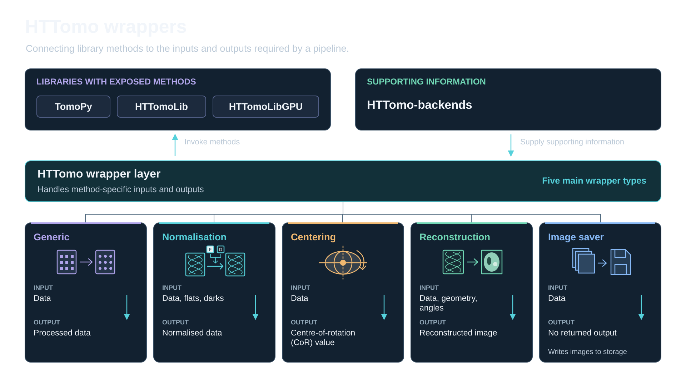{
  width=100%
  fig-alt="HTTomo wrappers"
}

::: {.footer}
[Enabling own methods in HTTomo](#own_methods)
:::


## 

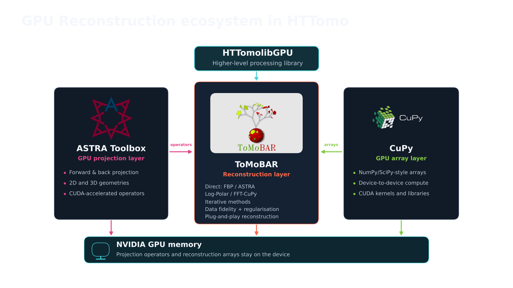{
  width=100%
  fig-alt="GPU reconstruction ecosystem"
}

##

{
  width=100%
  fig-alt="HTTomo features"
}

::: {.footer}
[HTTomo features](https://diamondlightsource.github.io/httomo/howto/httomo_features.html)
:::

## Loaders and preprocessors

1. Prepeare tomography datasets: synthetic and real data
2. Create a YAML pipeline with the loader and pre-processing methods
3. Modify the preview 
3. Run HTTomo
4. Inspect the correction results

## [NXtomo](https://manual.nexusformat.org/classes/applications/NXtomo.html) data generation with TomoPhantom {.small}


1. Install [tomophantom](https://github.com/dkazanc/tomophantom) into your existing HTTomo conda environemnt:

```bash
conda install -c httomo -c conda-forge tomophantom==3.1.5 psutil scikit-image
```

::: {.fragment}
2. Save [artefacts.json](https://github.com/dkazanc/httomo-nobugs26/tree/main/tomophantom/artefacts.json) and [flat_settings.json](https://github.com/dkazanc/httomo-nobugs26/tree/main/tomophantom/flat_settings.json) files into a directory (e.g., `synthdata`):
:::

::: {.fragment}

3. Generate NXTomo compliant synthethic data. 

From the command line and from the `synthdata` folder run the following command:

```bash
python -m tomophantom.scripts.nxs_generator --realistic -m 18 -s 256 512 740 \ 
  --flats 20 --darks 10 --source-intensity 20000 --artefacts artefacts.json \
  --flat-settings flat_settings.json --seed 1 -o tomodata_synth.nxs
```

::: {.callout-note}
One can also generate a smaller dataset if needed by changing the shape parameter in the command above, e.g., `-s 128 256 362`. It is also possible to change a model, e.g., a data of 3D Shepp-Logan phantom can be generated with `-s 13`.
:::

:::{.result}
The `tomodata_synth.nxs` file is generated containing darks, flats and projections.
:::
:::

::: {.footer}
[TomoPhantom Installation guide](https://dkazanc.github.io/TomoPhantom/) ·
[Generator script](https://github.com/dkazanc/TomoPhantom/blob/master/tomophantom/scripts/nxs_generator.py)
:::

## Visualising HDF5 and NeXus files

Browse the file hierarchy, inspect metadata, then plot a dataset.

:::: {.columns}
::: {.column width="48%"}
### [myHDF5](https://myhdf5.hdfgroup.org/)

**Quick exploration in your browser**

- Open local HDF5 files without installation.
- Explore groups and datasets, and visualise arrays.
- Local files stay on your computer.
:::

::: {.column width="48%"}
### [DAWN](https://dawnsci.org/)

**Desktop visualisation and analysis**

- Browse HDF5 and NeXus data.
- Fast data visualisation in 1D, 2D and 3D.
- Use scientific processing workflows.
:::
::::

### Other useful choices

::: {.smaller}
- [HDFView](https://www.hdfgroup.org/download-hdfview/): inspect and edit HDF5 structure, attributes and data.
- [silx view](https://www.silx.org/doc/silx/latest/applications/view.html): browse HDF5 and plot NeXus `NXdata` groups.
- [NeXpy](https://nexpy.github.io/nexpy/): explore and analyse NeXus data with a Python GUI.
:::

::: {.notes}
NeXus uses HDF5 with conventions for organising scientific data. An NXdata group describes a signal and its axes, helping compatible viewers produce meaningful plots.

Suggested demonstration: open a file, inspect groups and attributes, select a dataset, and display a line plot or image. For NeXus, locate an NXdata group and check the signal, axes and units.

Sources:
- https://myhdf5.hdfgroup.org/
- https://dawnsci.org/
- https://www.hdfgroup.org/download-hdfview/
- https://manual.nexusformat.org/examples/view/index.html
- https://manual.nexusformat.org/introduction.html
:::

## Visualise the generated data

A sinogram view of `tomodata_synth.nxs` using [DAWN](https://dawnsci.org/)

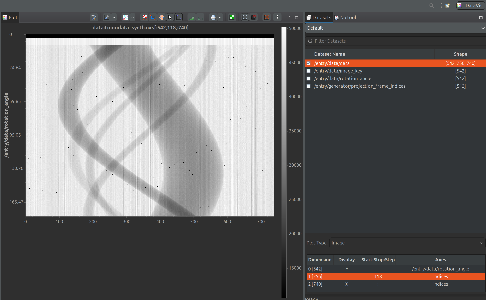{
  width=100%
  fig-alt="Dawn synthethic"
}

## HTTomo loader and data previewing {.smaller}

::: {.columns}
::: {.column width="40%"}
###  YAML for the HDF5/nxs loader

```yaml
- method: standard_tomo
  module_path: httomo.data.hdf.loaders
  parameters:
    data_path: auto # 'auto' key for NXtomo standard
    image_key_path: auto
    rotation_angles: auto
    preview:
      detector_x: # horizontal previewing
        start: null
        stop: null
      detector_y: # vertical previewing
        start: null
        stop: null
    darks: null
    flats: null
```
:::

::: {.column width="2%"}
<!-- empty column to create gap -->
:::

::: {.column width="57%"}

::: {.fragment}

### Previewing

[Data previewing](https://diamondlightsource.github.io/httomo/howto/httomo_features/previewing.html) **crops data during loading** to reduce processing time and/or test parameters.

- Data axes: **(angles, detector_y, detector_x)**.
- Use `null`: to keep the full dimension.
- Ranges use zero-based indices.

Examples:

```yaml
  preview:
    detector_y:
      start: 50
      stop: 100
```
:::

::: {.fragment}
or use `mid` keyword to select the middle part:

```yaml
  preview:
    detector_y:
      start: mid
      start_offset : -10
      stop: mid
      stop_offset : 10
```
:::
:::
:::

::: {.footer}
[HTTomo loader details](https://diamondlightsource.github.io/httomo/reference/loaders.html) and [previewing](https://diamondlightsource.github.io/httomo/howto/httomo_features/previewing.html)
:::


## Building HTTomo pipeline using YAML templates {.small}

::: {.columns}
::: {.column width="48%"}
### Finding and copying a method

1. Open [Methods YAML Templates](https://diamondlightsource.github.io/httomo/backends/templates.html). See the **latest** templates.
2. Select a library and a module, then find the method. Copy its **YAML block** or use **Download**.
3. Paste into **YAML pipeline** after the loader. Keep method entries aligned.

::: {.callout-note}
Use the editors that support YAML syntax highlighting, e.g., vscodium, VSCode, Atom, PyCharm and others.
:::

4. Edit parameters, replace any `REQUIRED` values, and run [YAML checker](https://diamondlightsource.github.io/httomo/utilities/yaml_checker.html) before processing to validate the resulting YAML.

:::
::: {.column width="2%"}
<!-- empty column to create gap -->
:::
::: {.column width="50%"}

::: {.fragment}

### Example: adding GPU pre-processing methods

::: {.callout-warning}
The methods from the [HTTomolibgpu](https://github.com/DiamondLightSource/httomolibgpu) library use the GPU backend.
:::

From [HTTomolibgpu normalization templates](https://diamondlightsource.github.io/httomo-backends/api/httomolibgpu.prep.normalize.html), paste these blocks **after your loader**:

```yaml
# Existing loader stays above these methods.
- method: dark_flat_field_correction
  module_path: httomolibgpu.prep.normalize
  parameters:
    flats_multiplier: 1.0
    darks_multiplier: 1.0
    upper_bound: null
    lower_bound: null

- method: minus_log
  module_path: httomolibgpu.prep.normalize
  parameters: {}
```

:::
:::
:::

## Exercise 1: pre-processing (d/f correction) {#exercise1 .small}

::: {.columns}
::: {.column width="49%"}
### Your task ~ 10 minutes


Use the generated **synthetic transmission data** to correct for flats and darks and take negative log.


::: {.fragment}

**1. Dark/flat correction** estimates transmission:

$$T = \frac{I-D}{F-D}$$

$I$: sample image. $D$: mean dark, beam off. $F$: mean flat, beam on without the sample. Subtracting $D$ removes detector offset. Dividing by $F-D$ corrects illumination and pixel-response variations.
:::
::: {.fragment}

**2. Negative log** gives an attenuation projection:

$$p=-\ln T \approx \int_{\mathrm{ray}}\mu(s)\,ds$$

The Beer–Lambert model converts transmission into the line integrals used in reconstruction.
:::
:::
::: {.column width="2%"}
<!-- empty column to create gap -->
:::
::: {.column width="49%"}
::: {.fragment}

### Task steps:

1. Save your loader configuration as `pipeline_synth.yaml`. Select a small vertical preview (e.g., 10 rows/slices).
2. Copy **normalize**, then **minus_log** from the [TomoPy YAML templates](https://diamondlightsource.github.io/httomo-backends/api/tomopy.prep.normalize.html) below the loader.
3. Add [saving](https://diamondlightsource.github.io/httomo/howto/process_lists/save_results/save_results.html#example-1-save-output-of-a-specific-method) into the HDF5 file for  **minus_log**.
4. Validate the YAML file with [YAML checker](https:/K/diamondlightsource.github.io/httomo/utilities/yaml_checker.html):
```bash
python -m httomo check pipeline_synth.yaml tomodata_synth.nxs
```
5. Run the pipeline with:
```bash
python -m httomo run pipeline_synth.yaml tomodata_synth.nxs output/
```
6. Inspect the results with [DAWN](https://dawnsci.org/) or [myhdf5](https://myhdf5.hdfgroup.org/), or any HDF5 viewer.
:::
:::
:::


## Exercise 2: pre-processing (de-zingering) {#exercise2 .small}

::: {.columns}
::: {.column width="49%"}
### Your task ~ 5 minutes

Remove zingers (outliers) from the projections.

::: {.fragment}

A **zinger** is a spurious, isolated intensity spike or small cluster of pixels. A **dezinger** method detects and replaces these outliers.

**Origin:** cosmic rays or scattered X-rays can strike the camera sensor directly, depositing much more energy than the normal scintillator light signal.

### TomoPy's `remove_outlier3d`

Uses a **local 3D median** to selectively replace outliers, retaining other values.

- **`size: 3`** is a 3 × 3 × 3 neighbourhood.
- **`dif`** difference value between outlier value and the median value of the neighbourhood. If zero, equivalent to a median filter.
::: 
:::

::: {.column width="2%"}
<!-- empty column to create gap -->
:::

::: {.column width="49%"}
::: {.fragment}

### Task steps:

1. Use `pipeline_synth.yaml` from [Exercise 1](#exercise1) to add **zinger removal** method using the TomoPy's [remove_outlier3d](https://tomopy.readthedocs.io/en/stable/_modules/tomopy/misc/corr.html#remove_outlier3d). 
2. Add the appropriate [TomoPy YAML template](https://diamondlightsource.github.io/httomo-backends/api/tomopy.misc.corr.html) right after the loader and before any other method.
3. Add [saving](https://diamondlightsource.github.io/httomo/howto/process_lists/save_results/save_results.html#example-1-save-output-of-a-specific-method) into the HDF5 file for the result of **remove_outlier3d**.
4. Validate the YAML file with [YAML checker](https:/K/diamondlightsource.github.io/httomo/utilities/yaml_checker.html):
```bash
python -m httomo check pipeline_synth.yaml tomodata_synth.nxs
```
5. Run the pipeline with:
```bash
python -m httomo run pipeline_synth.yaml tomodata_synth.nxs output/
```
6. Inspect the results (compare data before and after filtering).
:::
:::
:::

::: {.footer}
[Zinger origins](https://www.mcs.anl.gov/research/projects/X-ray-cmt/rivers/tutorial.html)
:::


## Exercise 3: pre-processing (de-stripe) {#exercise3 .small}

::: {.columns}
::: {.column width="52%"}
### Your task ~ 7 minutes

Use `tomodata_synth.nxs` to remove **stripes** from the sinograms or **rings** from reconstructions.

Residual detector-response errors, defective pixels or changing flat fields can leave intensity errors at fixed detector positions across many projections.

::: {.fragment}

### Methods to compare

TomoPy [provides](https://tomopy.readthedocs.io/en/stable/api/tomopy.prep.stripe.html) several methods to remove stripes:

- **`remove_stripe_fw`**: Fourier–wavelet filtering of stripe patterns.

- **`remove_stripe_based_sorting`**: sorting-based correction of full and partial stripes.

- **`remove_all_stripe`**: combines approaches for several stripe types, including large and unresponsive stripes.
:::
:::
::: {.column width="2%"}
<!-- empty column to create gap -->
:::

::: {.column width="45%"}

::: {.fragment}

### Task steps:

1. Use `pipeline_synth.yaml` from [Exercise 2](#exercise2) and add a **stripe removal** method from TomoPy's [selection](https://tomopy.readthedocs.io/en/stable/api/tomopy.prep.stripe.html). 
2. Add the appropriate [TomoPy YAML template](https://diamondlightsource.github.io/httomo-backends/api/tomopy.prep.stripe.html) after all methods.
3. Add [saving](https://diamondlightsource.github.io/httomo/howto/process_lists/save_results/save_results.html#example-1-save-output-of-a-specific-method) the result of **stripe removal** method into the HDF5 file.
4. Validate the YAML file with [YAML checker](https:/K/diamondlightsource.github.io/httomo/utilities/yaml_checker.html):
```bash
python -m httomo check pipeline_synth.yaml tomodata_synth.nxs
```
5. Run the pipeline with:
```bash
python -m httomo run pipeline_synth.yaml tomodata_synth.nxs output/
```
6. Inspect the results.
:::
:::
:::

::: {.footer}
[Stripe/ring artefacts guide](https://sarepy.readthedocs.io)
:::

## Reconstruction, centering, features

1. Tomographic reconstructing: synthetic and real data
2. Using the **center of rotation** finding methods
3. Parameter sweeps
3. Images and snapshot saving
4. Inspecting the logs


## Exercise 4: reconstruction {#exercise4 .small}

::: {.columns}
::: {.column width="49%"}
### Your task ~ 7 minutes

Reconstructing `tomodata_synth.nxs` after pre-processing.

After correction and negative log, each ray measures a **line integral of attenuation**:

$$p_\theta(s)=\int_{\mathrm{ray}(\theta,s)}\mu(x,y)\,d\ell$$

Reconstruction estimates **$\mu(x,y)$** from projections at many angles and parallel-beam data normally span **180°**, with sufficient angular sampling.

::: {.fragment}

TomoPy's **`gridrec`** is based on **Fourier slice theorem:** the 1D Fourier transform of a projection gives a radial line in the slice's 2D Fourier transform.

**`gridrec`** maps these Fourier samples onto a grid and inverts the transform. Reconstruction filters control the balance between resolution and noise.
:::
:::

::: {.column width="2%"}
<!-- empty column to create gap -->
:::

::: {.column width="47%"}

::: {.fragment}

### Tasks list:

1. Use `pipeline_synth.yaml` from [Exercise 3](#exercise3) and add a [reconstruction](https://tomopy.readthedocs.io/en/stable/api/tomopy.recon.algorithm.html) module from TomoPy. 
2. Add the following reconstruction YAML template after all methods.
```yaml
- method: recon
  module_path: tomopy.recon.algorithm
  parameters:
    center: null # assumption of the centered data
    sinogram_order: false
    algorithm: gridrec # selecting Gridrec algorithm
    filter_name: shepp # Shepp-Logan filter
    init_recon: null
```
3. Validate the YAML file, run the pipeline and inspect the results.
:::
:::

::: {.footer}
[Stripe/ring artefacts guide](https://sarepy.readthedocs.io)
:::

:::


## Switching off dezinger and destripper 

One can switch off dezinger and destripper to see the effect of these methods on the reconstruction.

<details>
<summary>YAML CPU pipeline for synthethic data</summary>


```yaml
# --- Standard tomography loader for NeXus files. ---
- method: standard_tomo
  module_path: httomo.data.hdf.loaders
  parameters:
    data_path: auto
    image_key_path: auto
    rotation_angles: auto
    preview:
      detector_x:   # horizontal data previewing/cropping.
        # when null, the full data dimension is used, i.e., no previewing
        start: null
        stop: null
      detector_y:
        start: mid
        start_offset : -10
        stop: mid
        stop_offset : 10    
    darks: null
    flats: null
# - method: remove_outlier3d
#   module_path: tomopy.misc.corr
#   parameters:
#     dif: 10000
#     size: 3  
- method: normalize
  module_path: tomopy.prep.normalize
  parameters:
    cutoff: null
    averaging: mean
# - method: remove_stripe_fw
#   module_path: tomopy.prep.stripe
#   parameters:
#     level: null
#     wname: db5
#     sigma: 2
#     pad: true
- method: minus_log
  module_path: tomopy.prep.normalize
  parameters: {}
- method: recon
  module_path: tomopy.recon.algorithm
  parameters:
    center: null
    sinogram_order: false
    algorithm: gridrec
    filter_name: shepp
    init_recon: null
```
</details>


## GPU YAML pipeline for synthetic data

::: {.callout-warning}
This pipeline is for **CUDA-enabled Linux or WSL** installations. It uses the GPU backend from the `httomolibgpu` library. 
:::

<details>
<summary>Full YAML GPU pipeline for synthethic data</summary>


```yaml
# --- Standard tomography loader for NeXus files. ---
- method: standard_tomo
  module_path: httomo.data.hdf.loaders
  parameters:
    data_path: auto
    image_key_path: auto
    rotation_angles: auto
    preview:
      detector_x:   # horizontal data previewing/cropping.
        # when null, the full data dimension is used, i.e., no previewing
        start: null
        stop: null
      detector_y:
        start: mid
        start_offset : -10
        stop: mid
        stop_offset : 10    
    darks: null
    flats: null
# --- Removing unresponsive/dead pixels in the data, aka zingers. Use if sharp streaks are present in the reconstruction. To be applied before normalisation. ---
- method: remove_outlier
  module_path: httomolibgpu.misc.corr
  parameters:
    kernel_size: 3  # The size of the 3D neighbourhood surrounding the voxel. Odd integer.
    dif: 1000 # A difference between the outlier value and the median value of neighbouring pixels.
# --- Normalisation of projection data using collected flats/darks images. --- 
- method: dark_flat_field_correction
  module_path: httomolibgpu.prep.normalize
  parameters:
    flats_multiplier: 1.0
    upper_bound: null
    lower_bound: null
- method: minus_log
  module_path: httomolibgpu.prep.normalize
  parameters: {}
# --- stripe removal method. ---  
- method: remove_stripe_fw
  module_path: httomolibgpu.prep.stripe
  parameters:
    sigma: 2
    wname: db5
    level: null  
# --- Reconstruction method. ---
- method: LPRec3d_tomobar
  module_path: httomolibgpu.recon.algorithm
  parameters:
    center: null
    detector_pad: false # Horizontal detector padding to minimise circle/arc-type artifacts in the reconstruction. Set to 'true' to enable automatic padding or an integer
    filter_type: shepp
    filter_freq_cutoff: 1.0
    recon_size: null
    recon_mask_radius: 0.95 
```
</details>

## Download real raw data from TomoBank {#real_data .small}

:::: {.columns}
::: {.column width="42%"}

### 1. Download the data
- [Download](https://www.swisstransfer.com/dl/01a0a9f5-b9a7-72a6-b225-7ca3eba87caa) the [TomoBank Lorentz dataset](https://tomobank.readthedocs.io/en/latest/source/data/docs.data.lorentz.html) as the **`tomo_00088.h5`** file to your workshop folder .

### 2. Configure the loader

Copy the loader on the right to your new pipeline, e.g., `pipeline_tomo88.yaml`. 

::: {.callout-note}
As the file `tomo_00088.h5` doesn't comply with the NXTomo standard, there is a change of the paths to data within the file. We need to explicitly specify the paths to projections, darks and flats datasets.

We also need to specify the rotation angles as the dataset doesn't contain them. The angles are known from the experiment.
:::
:::

::: {.column width="2%"}
<!-- empty column to create gap -->
:::

::: {.column width="56%"}

```{.yaml code-font-size="0.55em"}
- method: standard_tomo
  module_path: httomo.data.hdf.loaders
  parameters:
    data_path: /exchange/data
    image_key_path: null # no keys in the dataset
    rotation_angles:
      user_defined:
        start_angle: 0
        stop_angle: 179.876
        angles_total: 1500
    preview:
      detector_y:
        start: mid
        start_offset : -10
        stop: mid
        stop_offset : 10
    darks:
      file: input_data 
      image_key_path: null
      data_path: /exchange/data_dark
    flats:
      file: input_data
      image_key_path: null
      data_path: /exchange/data_white
    continuous_scan_subset: null
```

:::

::::

::: {.footer}
[HTTomo real data example](https://diamondlightsource.github.io/httomo/howto/how_to_run/real_data_example.html)
:::

## Centre of Rotation (CoR) estimation {#cor_estimation .small}

::: {.columns}
::: {.column width="50%"}

::: {style="text-align: center;"}
{
  width=63%
  fig-alt="The issue of CoR"
}
:::

The CoR parameter can be defined as a distance $d$ that translates the coordinate system $(x,y)$ of the scanned object to the coordinate system $(s,p)$ of the acquisition device. This leads to a simple linear mapping: $(s = x \pm d, p = y)$.

$d$ - should be established either experimentally or computationally. 

:::
::: {.column width="2%"}
<!-- empty column to create gap -->
:::

::: {.column width="48%"}

::: {.fragment}

### Methods for CoR estimation

In HTTomo, the CoR can be estimated by using:

1. Methods that rely on the rotational symmetry of a sinogram (e.g., [Find center by N.Vo](#cor-search)) or alignment of projections ([Phase cross-correlation](https://tomopy.readthedocs.io/en/stable/api/tomopy.recon.rotation.html#tomopy.recon.rotation.find_center_pc)).
2. Methods evaluating quality metrics of the reconstruction: [metrics-based finder](https://tomopy.readthedocs.io/en/stable/api/tomopy.recon.rotation.html#tomopy.recon.rotation.find_center)
3. Feature that perform manual search through the [sweeping functionality](#sweeping) in HTTomo. 
:::
:::
:::

::: {.footer}
[Details on CoR](https://diamondlightsource.github.io/httomo/howto/httomo_features/centering.html)
:::

## Finding the center of rotation using N.Vo method {#cor-search}

<video data-autoplay loop muted playsinline controls preload="auto" poster="images/cor-search-poster.png" style="display:block; width:90%; margin:0 auto;">
<source src="images/cor-search.mp4" type="video/mp4">
</video>

::: {style="font-size: 0.5em;"}
Synthetic demonstration inspired by [Vo et al., Optics Express 22, 19078–19086 (2014)](https://doi.org/10.1364/OE.22.019078). In TomoPy: [`find_center_vo`](https://tomopy.readthedocs.io/en/stable/api/tomopy.recon.rotation.html#tomopy.recon.rotation.find_center_vo).
:::

## Side outputs {#side-outputs .small}

A [side-output](https://diamondlightsource.github.io/httomo/howto/process_lists/side_outputs/side_out.html#side-output) is an additional result that certain methods provide through non-generic [wrappers](#wrappers). The side output is used by later methods in the pipeline. 

Example: [HTTomo auto-centering](https://diamondlightsource.github.io/httomo/howto/httomo_features/centering.html#auto-centering) produces a **centre-of-rotation value** that reconstruction uses automatically.

:::: {.columns}
::: {.column width="55%"}

### Using side outputs in YAML

```{.yaml code-line-numbers="12-14|20"}
# After pre-processing: estimate the CoR
- method: find_center_vo
  module_path: httomolibgpu.recon.rotation
  parameters:
    ind: mid
    smin: -50
    smax: 50
    srad: 6
    step: 0.25
    ratio: 0.5
    drop: 20
  id: centering
  side_outputs:
    cor: centre_of_rotation

# Reconstruction using the estimated CoR
- method: FBP3d_tomobar
  module_path: httomolibgpu.recon.algorithm
  parameters:
    center: ${{centering.side_outputs.centre_of_rotation}}
    filter_freq_cutoff: 1.1
    recon_size: null
    recon_mask_radius: null
```

:::
::: {.column width="45%"}

### How the reference works

1. **Provide an ID**, e.g., `id: centering`.

2. **Name its result**  
   `cor` is the exposed output key.  
   `centre_of_rotation` is the name you assign to it.

3. **Use it as a parameter**  
   `${{…}}` tells HTTomo to resolve the reference at runtime and supply the calculated value to `center`.

::: {.callout-note}
**Method order matters:** place auto-centering before reconstruction but after preprocessing (e.g., d/f correction).
:::

:::
::::


## Exercise 5: reconstruction with auto-centering {#excercise5 .small}

### Your task ~ 7 minutes

Use real data `tomo_00088.h5` to perform d/f correction, auto-centering and reconstruction.

1. Use `pipeline_tomo88.yaml` with the modified YAML [loader](#real_data).
2. Add d/f correction and negative logarithm. 
3. Add the [`find_center_vo`](https://tomopy.readthedocs.io/en/stable/api/tomopy.recon.rotation.html#tomopy.recon.rotation.find_center_vo) method by using the [YAML template](https://diamondlightsource.github.io/httomo-backends/api/tomopy.recon.rotation.html) for it.
4. Add the `gridrec` reconstruction method using provided [YAML template](https://diamondlightsource.github.io/httomo-backends/api/tomopy.recon.algorithm.html).

::: {.callout-note}
Note that `center` in `parameters` points to the side output of the `find_center_vo` method by default.
```{.yaml code-line-numbers="2"}
  parameters:
    center: ${{centering.side_outputs.centre_of_rotation}}
    sinogram_order: false
    algorithm: gridrec
```
:::

5. Validate the YAML file and run the pipeline.

## Open MPI in HTTomo {#openmpi-benefits .small}

**Open MPI** is an open-source implementation of the **Message Passing Interface (MPI)**. It launches cooperating processes, called **ranks**, and lets them exchange data on one computer or across cluster nodes.

Parallel-beam tomography offers substantial **data parallelism** as operations can run independently on different projections or sinograms.

| Benefit | How HTTomo uses it |
|:--|:--|
| **Shorter processing time** | Ranks process different projections or reconstruct different slices concurrently. |
| **Distributed data** | Each rank handles a portion of the main dataset. Multiple nodes provide access to more aggregate RAM. |
| **Data exchange** | MPI enables redistribution between projection and sinogram processing patterns. |
| **Flexible deployment** | Run a pipeline on a workstation or on allocated cluster resources. |


::: {.footer}
[Data distribution in HTTomo figure](#mpi_figure)
:::


## Exercise 6: running pipelines in parallel {#excercise6 .small}

### Your task ~ 5 minutes

Re-run the pipeline from the [Excercise 5](#excercise5) in parallel. 

Start with 2 ranks run using the following command: 

```bash
mpirun -n 2 python -m httomo run tomo_00088.h5 pipeline_tomo88.yaml output
```

Where `-n`: stands for the number of processes, or **ranks**.
 
::: {.result}
The time of the parallel execution should be smaller compared to the `-n 1` baseline for 1 process. The optimal number of processes can be established through testing. Also you can monitor your CPU usage panel when executing the job.
:::
**You can continue using parallel execution for the rest of the session.**

::: {.fragment}
::: {.callout-note}
For the GPU runs, the number of processes is linked to the number of GPU cards available. 
:::
:::

## Exercise 7: saving images {#excercise7 .small}

### Your task ~ 5 minutes

Run the pipeline from the [Excercise 6](#excercise6) (parallel run) and add data rescaling and image saving. 

**After** the reconstruction step add the following YAML code: 

<details>
<summary>Stats, rescale and 16-bit tiffs saving</summary>


```yaml
- method: calculate_stats
  module_path: httomo.methods
  parameters: {}
  id: statistics
  side_outputs:
    glob_stats: glob_stats
- method: rescale_to_int
  module_path: httomolib.misc.rescale
  parameters:
    perc_range_min: 1.0
    perc_range_max: 99.0
    bits: 16
    glob_stats: ${{statistics.side_outputs.glob_stats}}
- method: save_to_images
  module_path: httomolib.misc.images
  parameters:
    subfolder_name: images
    axis: auto
    file_format: tif
    asynchronous: true
```
</details>


For the [real dataset](#real_data) from TomoBank the full CPU pipeline is the following:

<details>
<summary>Full CPU YAML pipeline</summary>


```yaml
- method: standard_tomo
  module_path: httomo.data.hdf.loaders
  parameters:
    data_path: /exchange/data
    image_key_path: null
    rotation_angles:
      user_defined:
        start_angle: 0
        stop_angle: 179.876
        angles_total: 1500
    preview:
      detector_y:
        start: 500
        stop: 510
    darks:
      file: input_data
      image_key_path: null
      data_path: /exchange/data_dark
    flats:
      file: input_data
      image_key_path: null
      data_path: /exchange/data_white
    continuous_scan_subset: null
- method: normalize
  module_path: tomopy.prep.normalize
  parameters:
    cutoff: null
    averaging: mean
- method: find_center_vo
  module_path: tomopy.recon.rotation
  parameters:
    ind: mid
    smin: -50
    smax: 50
    srad: 6
    step: 0.25
    ratio: 0.5
    drop: 20
  id: centering
  side_outputs:
    cor: centre_of_rotation
- method: remove_all_stripe
  module_path: tomopy.prep.stripe
  parameters:
    snr: 3
    la_size: 61
    sm_size: 21
    dim: 1
- method: minus_log
  module_path: tomopy.prep.normalize
  parameters: {}
- method: recon
  module_path: tomopy.recon.algorithm
  parameters:
    center: ${{centering.side_outputs.centre_of_rotation}}
    sinogram_order: false
    algorithm: gridrec
    init_recon: null
- method: calculate_stats
  module_path: httomo.methods
  parameters: {}
  id: statistics
  side_outputs:
    glob_stats: glob_stats
- method: rescale_to_int
  module_path: httomolib.misc.rescale
  parameters:
    perc_range_min: 1.0
    perc_range_max: 99.0
    bits: 16
    glob_stats: ${{statistics.side_outputs.glob_stats}}
- method: save_to_images
  module_path: httomolib.misc.images
  parameters:
    subfolder_name: images
    axis: auto
    file_format: tif
    asynchronous: true
```
</details>


::: {.fragment}

The corresponding GPU pipeline is the following: 

<details>
<summary>Full GPU YAML pipeline</summary>


```yaml
- method: standard_tomo
  module_path: httomo.data.hdf.loaders
  parameters:
    data_path: /exchange/data
    image_key_path: null
    rotation_angles:
      user_defined:
        start_angle: 0
        stop_angle: 179.876
        angles_total: 1500
    preview:
      detector_y:
        start: 500
        stop: 510
    darks:
      file: input_data
      image_key_path: null
      data_path: /exchange/data_dark
    flats:
      file: input_data
      image_key_path: null
      data_path: /exchange/data_white
    continuous_scan_subset: null
- method: dark_flat_field_correction
  module_path: httomolibgpu.prep.normalize
  parameters:
    flats_multiplier: 1.0
    darks_multiplier: 1.0
    upper_bound: null
    lower_bound: null
    clipping_warning: false
- method: find_center_vo
  module_path: httomolibgpu.recon.rotation
  parameters:
    ind: mid
    average_radius: 0
    cor_initialisation_value: null
    smin: -50
    smax: 50
    srad: 6.0
    step: 0.5
    ratio: 0.5
    drop: 20
  id: centering
  side_outputs:
    cor: centre_of_rotation
- method: remove_all_stripe
  module_path: httomolibgpu.prep.stripe
  parameters:
    snr: 3.0
    la_size: 61
    sm_size: 21
    dim: 1
    normalize: false
- method: minus_log
  module_path: httomolibgpu.prep.normalize
  parameters: {}
- method: FBP3d_tomobar
  module_path: httomolibgpu.recon.algorithm
  parameters:
    center: ${{centering.side_outputs.centre_of_rotation}}
    detector_pad: false
    filter_freq_cutoff: 0.35
    recon_size: null
    recon_mask_radius: 0.95
- method: calculate_stats
  module_path: httomo.methods
  parameters: {}
  id: statistics
  side_outputs:
    glob_stats: glob_stats
- method: rescale_to_int
  module_path: httomolib.misc.rescale
  parameters:
    perc_range_min: 1.0
    perc_range_max: 99.0
    bits: 16
    glob_stats: ${{statistics.side_outputs.glob_stats}}
- method: save_to_images
  module_path: httomolib.misc.images
  parameters:
    subfolder_name: images
    axis: auto
    file_format: tif
    asynchronous: true
```
</details>
:::

::: {.footer}
[Real data example in HTTomo documentation](https://diamondlightsource.github.io/httomo/howto/how_to_run/real_data_example.html)
:::

## Interpreting HTTomo logs

:::: {.columns}
::: {.column width="31%"}

### Log outputs

| Output | What it tells you |
|:--|:--|
| **Terminal (stdout)** | Concise run status and progress |
| **`user.log`** | The same concise information, saved to file |
| **`debug.log`** | More detailed information for debugging |

:::
::: {.column width="2%"}
<!-- empty column to create gap -->
:::
::: {.column width="67%"}

### Reading the sections

1. **`Pipeline has been separated into N sections`**   HTTomo groups methods into [sections](#sections) that process data blocks.
2. **Loader runs first, outside the sections.**   It loads data in projection `pattern`, which the first section also uses.
3. **`Section N with the following methods`**   The listed methods run sequentially on each block. The section processes all its input before the next section starts.
4. **`Finished processing the last block`**   The current section has finished. Another section may follow.

::: {.reading}
**Example:** `1/2` means one of two blocks completed in this section (**50%**). Elapsed/remaining times and `s/block` describe section progress. Faster processing may use `block/s`.
:::

:::
::::

::: {.footer}
[Interpret logs in HTTomo](https://diamondlightsource.github.io/httomo/howto/interpret_logger.html)
:::


## Sweeping functionality {#sweeping .small}

:::: {.columns}
::: {.column width="54%"}

### What is it

[HTTomo parameter sweeping](https://diamondlightsource.github.io/httomo/howto/httomo_features/parameter_sweeping.html) runs a method on the same input data using several values of one parameter, allowing you to compare the results and choose a suitable value.


::: {.fragment}

### When to use

Parameter sweeping is useful when automatic estimation fails or is unavailable. For example, if an automatic method cannot reliably estimate the [center of rotation](#cor_estimation), sweeping lets you compare reconstructions and select a suitable value.

:::

::: {.fragment}

### HTTomo feature

Parameter sweeping uses a separate runner in HTTomo, designed for debugging and parameter tuning rather than high-throughput processing.
:::
:::
::: {.column width="45%"}

::: {.fragment}

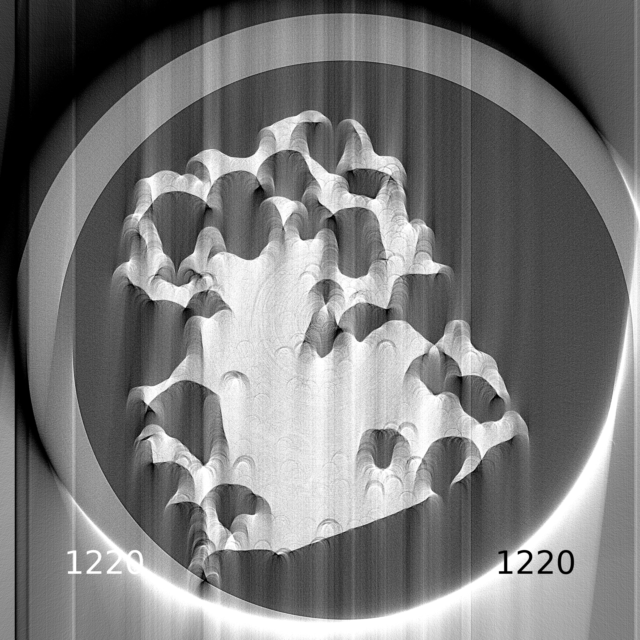{
  width=85%
  fig-alt="CoR sweeping"
}

::: {.caption}
Changing CoR changes the reconstruction. Each frame shows its trial value.
:::

:::

:::
::::


## HTTomo parameter sweeping feature {#sweep_syntax}

Run a method with several values of **one** parameter.

:::: {.columns}
::: {.column width="48%"}

### YAML syntax

**Range of values** (under `parameters:`) for the `center` parameter:

```yaml
center: !SweepRange
  start: 10
  stop: 50
  step: 10
```

Tests **10, 20, 30, 40**.

**Explicit values** given for the `size` parameter:

```yaml
size: !Sweep
  - 3
  - 5
```

:::
::: {.column width="2%"}
<!-- empty column to create gap -->
:::
::: {.column width="50%"}

### Setup and results

- Define **one sweep per pipeline**.
- Use loader `preview` to select few vertical slices.
- HTTomo saves sweep results as images **automatically**. No image-saving method is needed after the sweep.
- Each trial contributes its **middle slice** to the output, stacked along the middle dimension.

:::
::::

::: {.footer}
[HTTomo parameter sweeping guide](https://diamondlightsource.github.io/httomo/howto/httomo_features/parameter_sweeping.html)
:::

## Exercise 8: sweeping for CoR {#excercise8 .small}

### Your task ~ 10 minutes

Perform a **sweep** run for the [center of rotation](#cor_estimation) parameter using the YAML syntax [provided](#sweep_syntax). 

::: {.callout-note}
You need to remove all auto-centering methods from the pipeline as well as the tiff saving.
The run command itself doesn't change and remain the same as before. 
:::

## More advanced concepts

- HTTomo and large data processing
- GPU processing, memory management and padding
- Enabling new methods in HTTomo
- HTTomo for HPC environment

## Large datasets on workstations with limited RAM

Set a realistic **RAM budget per process** with `--max-memory` flag, so HTTomo can manage the larger data.

:::: {.columns}
::: {.column width="50%"}

### How HTTomo handles the large data

- Memory **peaks** at the [reslice](#reslice) operation
- **Enough RAM:** retain intermediate data in memory for speed (i.e., `in-memory` reslice).
- **Memory requirements exceed RAM:** automatically store intermediate data on disk and reload it as needed (i.e., `in-disk` reslice). 

::: {.fragment}

### Practical choices
- Start with **one process** and an accurate memory budget.
- Allow disk space for intermediate data and final results. Disk transfers add processing time.
- For `in-disk` re-slicing, use `--reslice-dir` to place temporary file on a faster file-system, e.g., NVMe SSD.
:::
:::
::: {.column width="49%"}

::: {.fragment}
### Example: one process, 32 GB workstation
```bash
httomo run \
  --max-memory 24G \
  data.nxs pipeline.yaml output/
```
allocate **24 GB** to HTTomo and leave 8 GB (or more) for the operating system and other applications.

For **P processes on one workstation**, divide the total HTTomo RAM budget by P.
:::

::: {.fragment}

::: {.callout-warning}
Even when the input data occupies only half the available RAM, intermediate data can grow beyond the RAM capacity during processing. Use disk-based processing in this case. Lowering `--max-memory`, for example to `1G`, encourages HTTomo to store intermediate data on disk.
:::

:::

:::
::::
::: {.footer}
[HTTomo run guide: max-memory](https://diamondlightsource.github.io/httomo/howto/how_to_run/run_in_depth.html#max-memory)
:::

## HTTomo for GPU processing

HTTomo is **designed** to perform GPU-accelerated processing. This is the **preferred approach** for achieving high-throughput processing.

Few efforts have been made to ensure this:

- GPU accelerated methods: [pre-processing](#gpu_methods_preproc) and [reconstruction](#gpu_methods_recon)
- [Efficient GPU utilisation](#gpu_data_management)
- Minimisation of device-transfer operations 


## GPU-accelerated pre-processing {#gpu_methods_preproc}

### GPU accelerated methods from the [HTTomoLibGPU](https://diamondlightsource.github.io/httomolibgpu/) library vs TomoPy CPU implementations.

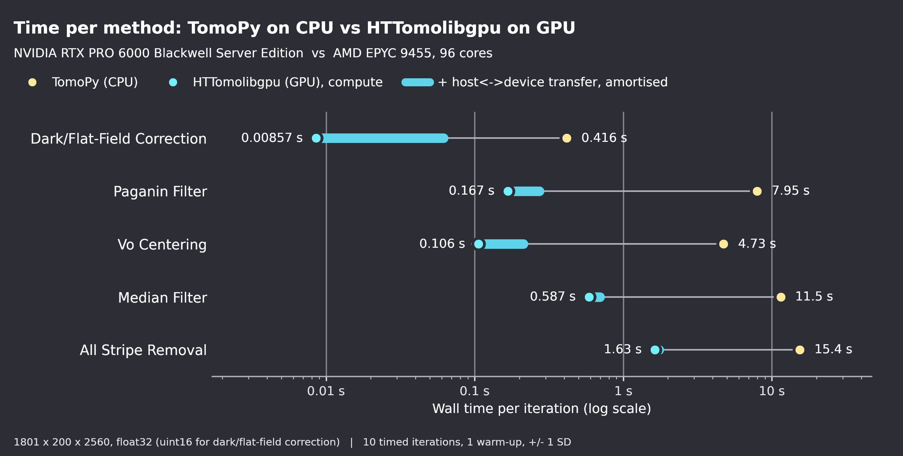{width="100%" fig-alt="CPU vs GPU methods with transfers" fig-align="center"}

## GPU-accelerated reconstruction {#gpu_methods_recon}

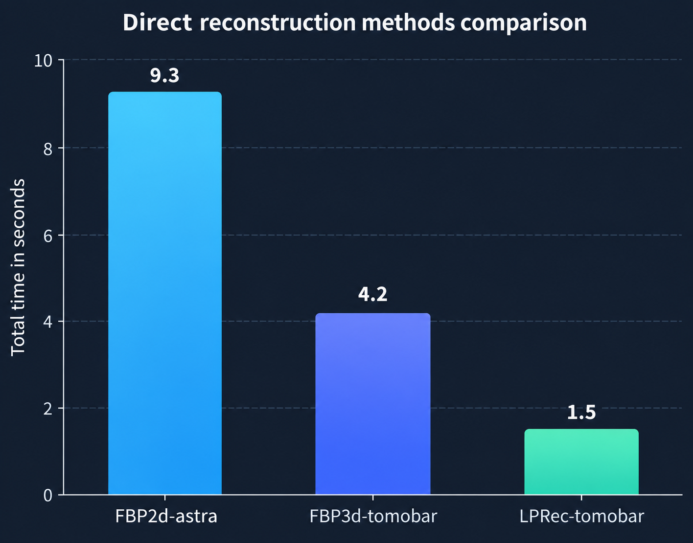{width="100%" fig-alt="GPU recon comparison" fig-align="center"}

::: {.footer}
[Tomographic Model-BAsed Reconstruction (ToMoBAR)](https://github.com/dkazanc/ToMoBAR)
:::

## HTTomo data management directons {#gpu_data_management}

:::: {.columns}
::: {.column width="48%"}

### Larger 3D blocks within the memory budget

- HTTomo divides data **chunks** into 3D **blocks** for GPU processing.
- Blocks as large as safely fit in GPU memory
- Memory estimators use **free VRAM** and each method’s requirements to determine how many slices fit.
- The **most memory-demanding method in a section** limits the block size.

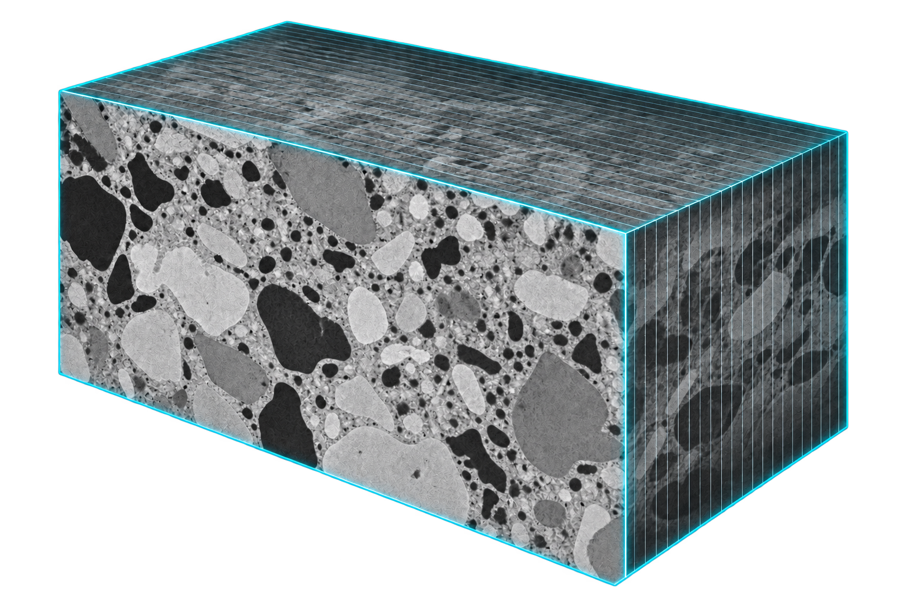{
  width=60%
  fig-alt="3d data block"
  fig-align="center"
}
:::
::: {.column width="2%"}
<!-- empty column to create gap -->
:::
::: {.column width="50%"}

::: {.fragment}
### Method chains to reduce transfers

HTTomo chains compatible GPU methods within a [section](#sections), keeping each block on the GPU between methods.

**For each block:**

1. Transfer the block to the GPU.
2. Run the GPU method chain.
3. Return the result to CPU only when its needed.

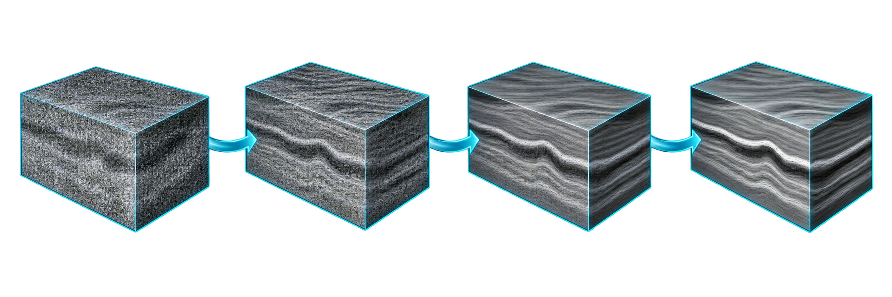{
  width=100%
  fig-alt="chain of 3D proceessing methods"
  fig-align="center"
}

:::

:::
::::

## Padding enables true 3D processing

A 3D method needs neighbouring slices. Padding preserves that context when HTTomo splits a volume into blocks.

:::: {.columns}
::: {.column width="42%"}

### Why padding is needed

- A **2D method** processes each frame independently, so a block boundary does not interrupt its neighbourhood.
- A **3D method** uses information along all three axes. At a block edge, it needs slices held in the neighbouring block.
- HTTomo pads the block with this surrounding data, allowing the method to satisfy its boundary conditions and avoid seam-like artefacts.

:::
::: {.column width="58%"}

::: {.fragment}

### Denoising comparison

::: {.image-row}
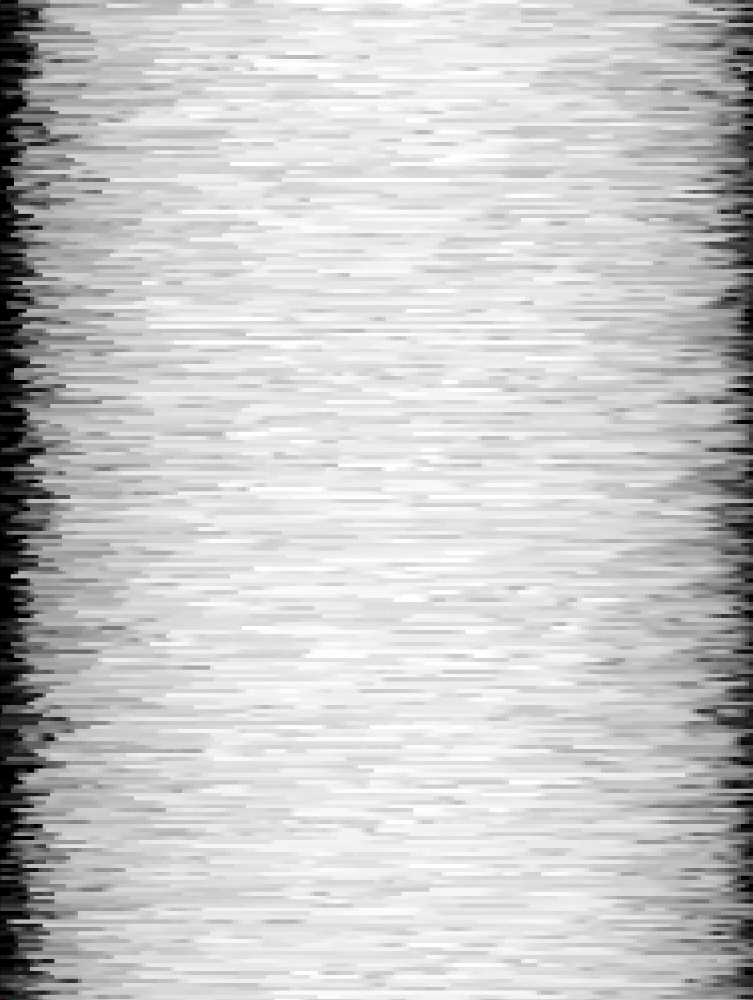{fig-alt="2D denoising" fig-align="center"}

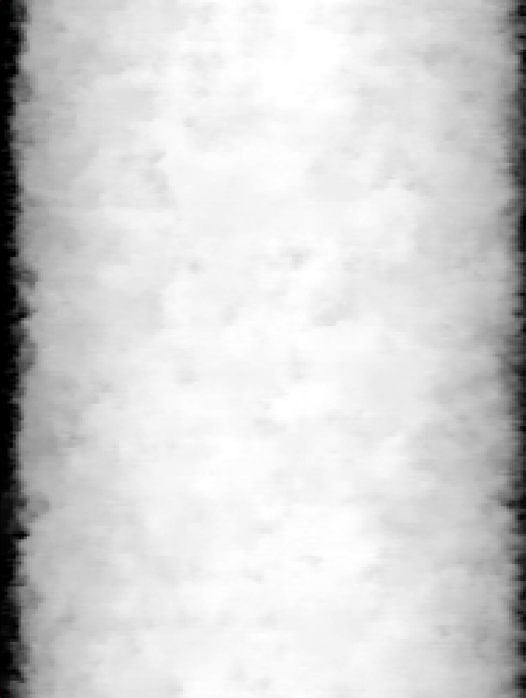{fig-alt="3D denoising" fig-align="center"}
:::

- Consistent resolution in all three dimensions
- Better removal of volumetric artefacts and improved contrast
- Access to advanced 3D filters and iterative reconstruction methods

:::
:::
::::

::: {.footer}
[HTTomo padding feature](https://diamondlightsource.github.io/httomo/howto/httomo_features/padding.html)
:::


## Adding a new method to HTTomo {#own_methods}

HTTomo runs methods from external Python libraries. Integration adds the metadata and configuration that the framework needs. The following steps need to be performed:

:::: {.columns}
::: {.column width="48%"}

### 1. Implement the method

Add a tested Python function to a supported library: [HTTomoLib](https://github.com/DiamondLightSource/httomolib) or [HTTomoLibGPU](https://github.com/DiamondLightSource/httomolibgpu), or a separate installable package.

::: {.fragment}

### 2. Register its properties

Add the method to the corresponding `httomo-backends` YAML [library file](https://github.com/DiamondLightSource/httomo-backends/tree/main/httomo_backends/methods_database/packages/backends). Declare its data pattern, implementation type, dimension changes, padding and save behaviour.

For a CPU method:

```yaml
implementation: cpu
memory_gpu: None
```
:::

::: {.column width="2%"}
:::

:::
::: {.column width="50%"}

::: {.fragment}

### 3. Check the wrapper

Choose the wrapper that matches the method’s input and output. A shape-preserving filter with one data input and one output normally uses the **generic wrapper**.

A new wrapper requires additional framework work.

:::
::: {.fragment}

### 4. Provide a method template

Create the YAML template used in a process list. Write it manually or use the `httomo-backends` [YAML generator](https://github.com/DiamondLightSource/httomo-backends/blob/main/httomo_backends/scripts/yaml_templates_generator.py).

Then test the function, backend metadata and pipeline execution together.
:::
:::
::::

::: {.footer}
[HTTomo contribution guide](https://diamondlightsource.github.io/httomo/developers/how_to_contribute.html)
:::

## Example: adding a CPU Gaussian filter

A shape-preserving filter can use the **generic wrapper** and needs no GPU-memory estimate.

:::: {.columns}
::: {.column width="52%"}

### Python library

```python
# my_filters/filters.py
import scipy.ndimage as ndi

def gaussian_filter(
    data, sigma=1.0
):
    return ndi.gaussian_filter(
        data, sigma
    )
```

::: {.fragment}

### Process-list template

```yaml
- method: gaussian_filter
  module_path: my_filters.filters
  parameters:
    sigma: 1.0
```

Package and test `my_filters` so it is importable.

:::
::: {.column width="2%"}
:::
:::
::: {.column width="46%"}
::: {.fragment}

### `httomo-backends` library entry

```yaml
# my_filters.yaml
filters:
  gaussian_filter:
    pattern: all
    output_dims_change: False
    implementation: cpu
    memory_gpu: None
    save_result_default: False
    padding: False
```

The **generic wrapper** imports the function, passes data blocks and parameters. Then returns the processed data.
:::
:::
::::

::: {.footer}
[Contribution guide](https://diamondlightsource.github.io/httomo/developers/how_to_contribute.html)
:::

## HPC processing - one cluster node

### Using four NVIDIA RTX PRO 6000 Blackwel GPUs

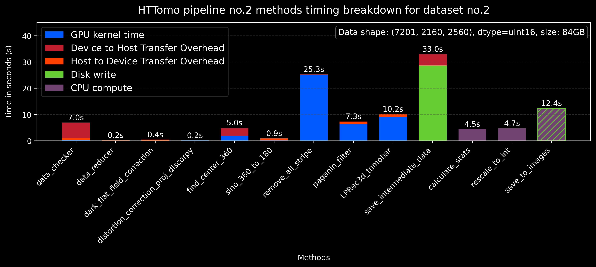{
  width=100%
  fig-alt="Blackwell 4 GPUs run"
  fig-align="left"
}

## HPC processing - multinode

### Using up to 4 NVidia V100s nodes

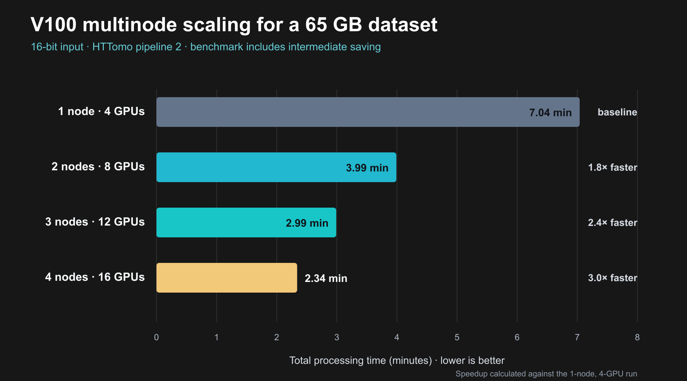{
  width=100%
  fig-alt="V100 multinode"
  fig-align="left"
}

## Acknowledgements

::: {.ack-intro}
HTTomo is a collective effort by software/method developers and beamline scientists at Diamond Light Source.
:::

:::: {.columns .ack-columns}
::: {.column width="22%"}

### Software developers:

- **Daniil Kazantsev**
- **Yousef Moazzam**
- **Naman Gera**
- **Jessica Verschoyle**
- **Timothy Poon**
- **Benedikt Daurer**

:::
::: {.column width="44%"}

### Beamline community

We thank Diamond’s beamline scientists for:

- Representative datasets and scientific requirements
- Software testing and validation on real experiments
- Feedback that improves methods, pipelines and usability

:::
::: {.column width="33%"}

### Diamond Light Source

We acknowledge Diamond Light Source and its technical teams for providing:

- Beamline and experimental facilities
- HPC and GPU computing resources
- Data infrastructure and operational support

:::
::::

::: {.footer}
Thanks for the participation!
:::